前回までにProxmoxのインストールと初期設定が完了したので、今度は仮想マシンを作成するところから。  

今回はWindows 11の仮想マシン作成。  

<!-- more -->

### Windows 11のISOイメージダウンロード

[oembed:"https://www.microsoft.com/ja-jp/software-download/windows11"]

Microsoftのサイトからダウンロードできる。  

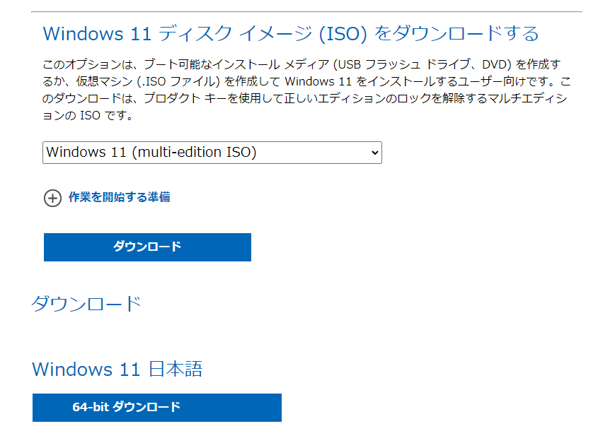

### ドライバーのISOイメージダウンロード  

VMWare ESXiではインストール中特に何もせずともインストールできるものの、Proxmoxではネットワークドライバなどを別途入れる必要があるため、[VirtIOのドライバISOイメージ](https://fedorapeople.org/groups/virt/virtio-win/direct-downloads/stable-virtio/virtio-win.iso)をダウンロードしておく。  


### ISOイメージのアップロード
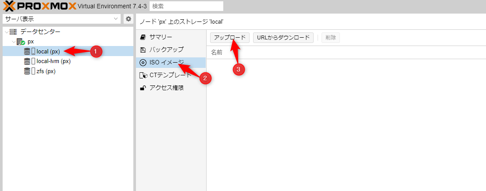

ホスト配下のストレージリストから `local(hostname)` を選択し、 `ISOイメージ` メニューを開き、 `アップロード` ボタンを押下。  

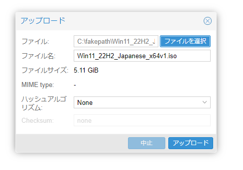  

  

`ファイルを選択` ボタンを押下するとファイル選択ウィンドウが表示されるので、アップロードしたいイメージファイルを選択。 `アップロード`ボタンを押下でサーバー側にイメージファイルが転送される。  


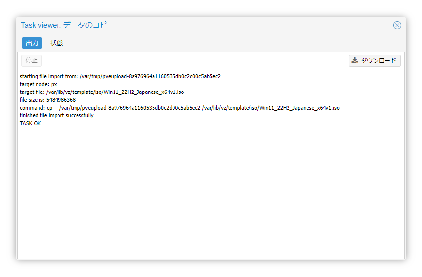  

転送が完了すると画像のように `TASK OK` というモーダルが表示される。  

Windows 11のISOイメージとVirtIOのISOイメージをそれぞれアップロードすること。  

### 仮想マシンの作成  
インストールするイメージファイルをProxmoxに転送したらVMの作成へ。  

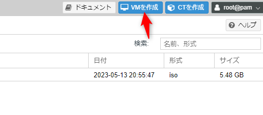  

Webインターフェース右上の `VMを作成` ボタンを押下。  

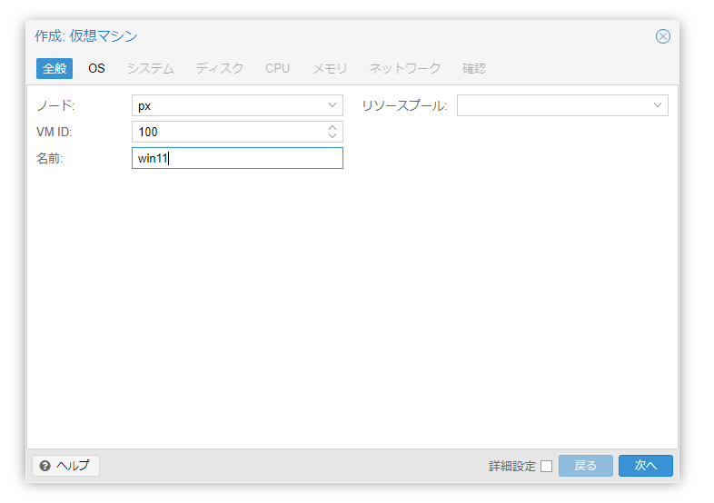  

仮想マシン名を名前欄に入力。VM IDなどはデフォルトでOK。  
 
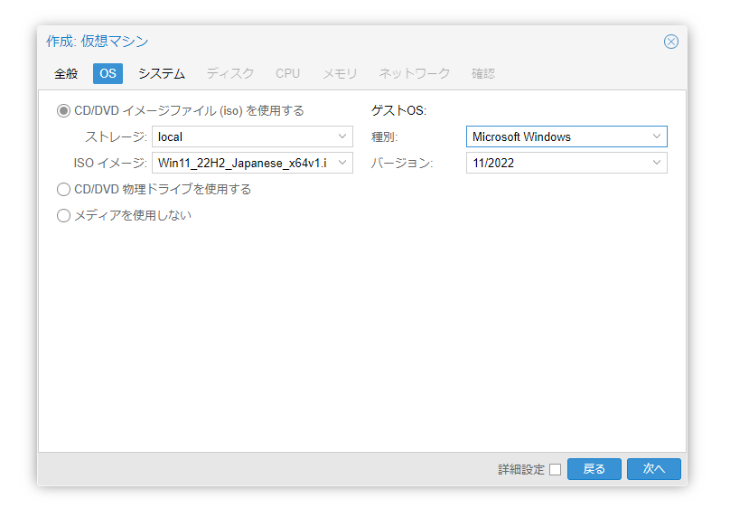  

ISOイメージは先ほどアップロードしたWindows 11のISOイメージを選択。  
ゲストOSは標準だとLinuxになっているので、種別を`Windows`、バージョンを `11/2022`に変更。  

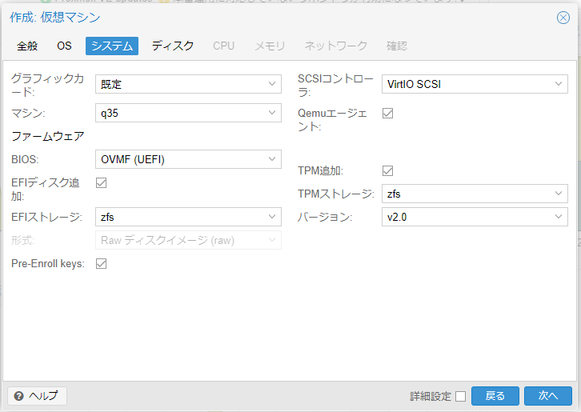  

システム設定。  
標準から下記の設定を変更。  
- SCSIコントローラーを`VirtIO SCSI Single` から `VirtIO SCSI`に変更(性能が良いらしい)
- EFIストレージをVMを配置するストレージに変更
- TPMストレージをVMを配置するストレージに変更
- `Qemuエージェント` にチェックを入れる
  - VMWareでいうVMware Tools的なもの

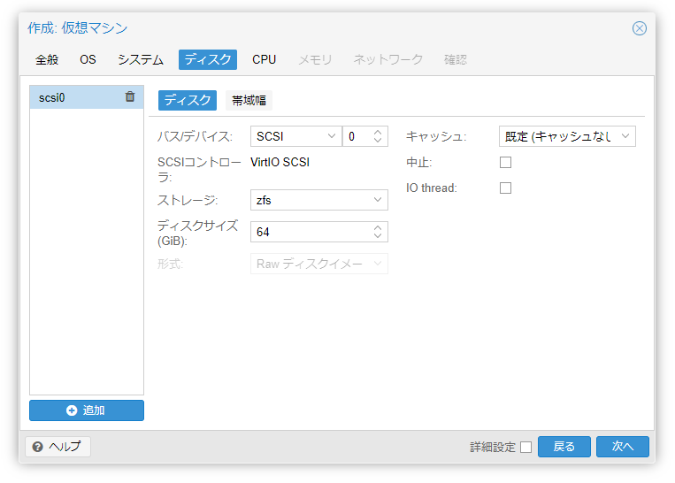  

VMを配置するストレージの設定。  
標準からは下記の設定を変更。  

- バス/デバイスを `IDE` から `SCSI` に変更
  - IDEだと性能が非常に悪くなる
- ストレージをVMを配置したいストレージに変更
- ディスクサイズをVMで利用したいサイズに変更

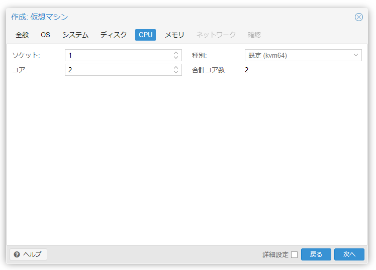  

CPU設定。  
Windowsで利用する分のコア数の設定。  
Windows 11は最低2コア必要なので注意。  

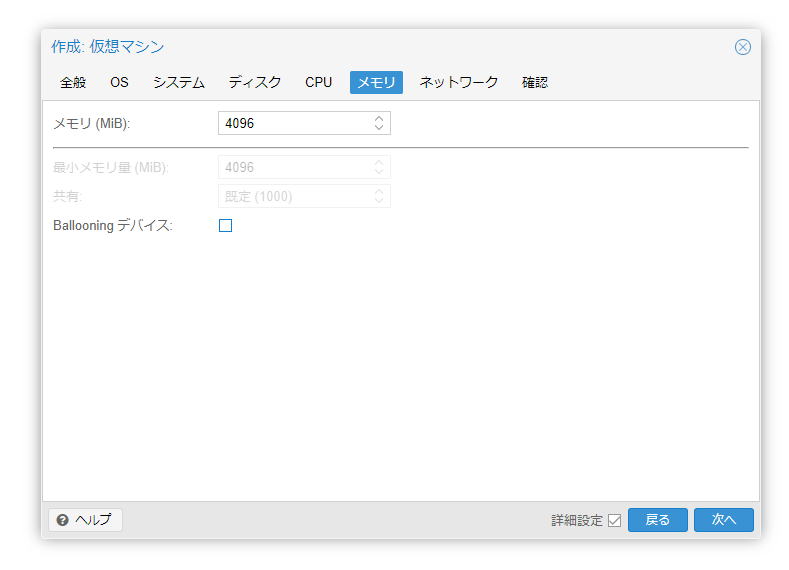  

Windowsに割り当てるメモリーサイズを指定。  
Windows 11は最低4GB必要。  
詳細設定にチェックを入れると出てくるBallooning デバイスは、VMが確保しているメモリーのうち使っていないメモリーを一旦開放し別のVMが利用できるようにするもの。  
利用する場合後で専用のドライバをインストールする必要がある。  


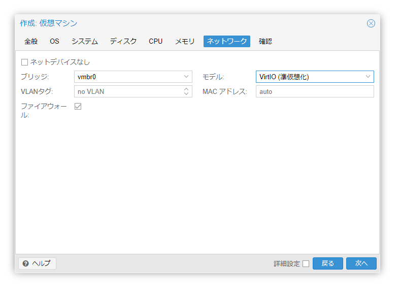  

ネットワーク設定はモデルを `Intel E1000` から `VirtIO`に変更。  

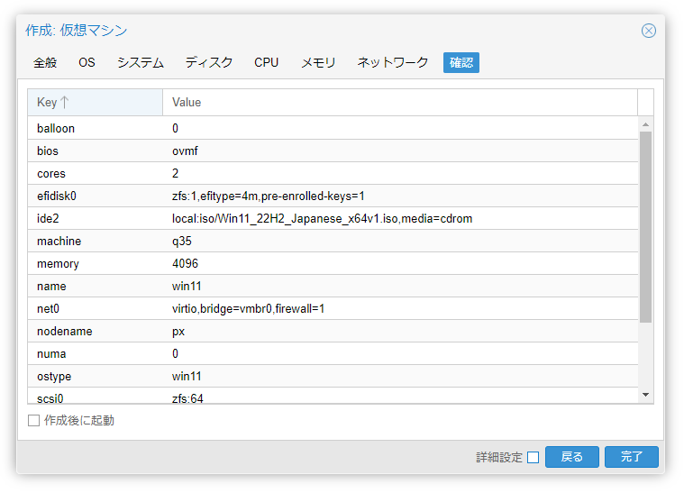  

確認画面。  
今回は別途設定が必要なので作成後に起動にチェックを入れずに完了。  

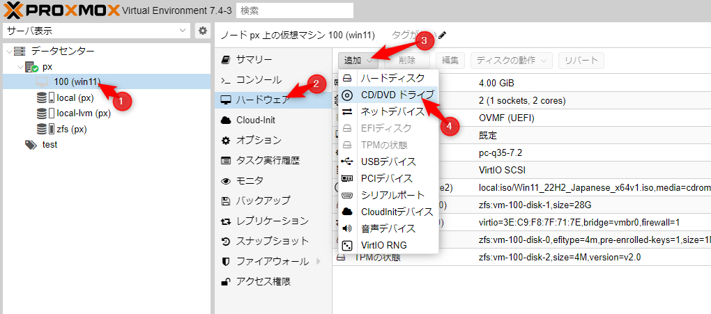  

VMが作成されると左のメニューに出てくるので選択。  
ハードウェアメニューの追加ボタンを押下し、`CD/DVDドライブ`を選択。  

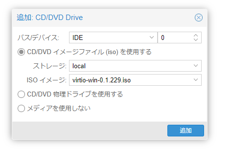  

`CD/DVDイメージファイル(ISO)を使用する` を選択した状態で、ISOイメージで先ほどアップロードしておいたVirtIOドライバのISOイメージファイルを選択して追加ボタンを押下。  

これでWindows 11インストールまでのVM設定は完了。  

### Windows 11のインストール  

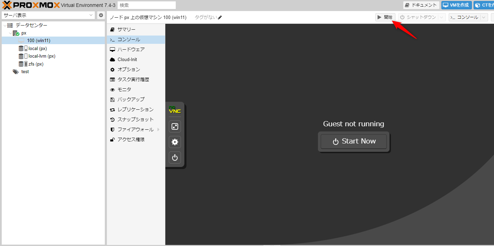  

画面右上の `開始` を押すか、コンソールを開いて `Start Now` を押すとVMが起動する。  

起動したら `Press any key to boot from CD or DVD......` が出てる間に適当なキーを押下。  

Windows 11のインストール画面がでたら通常通りインストールを進める。  

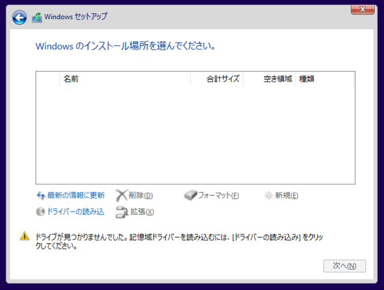  

途中Windowsのインストール場所を選択する画面になるとドライブが見つからないと警告が表示され、進めることができない。  

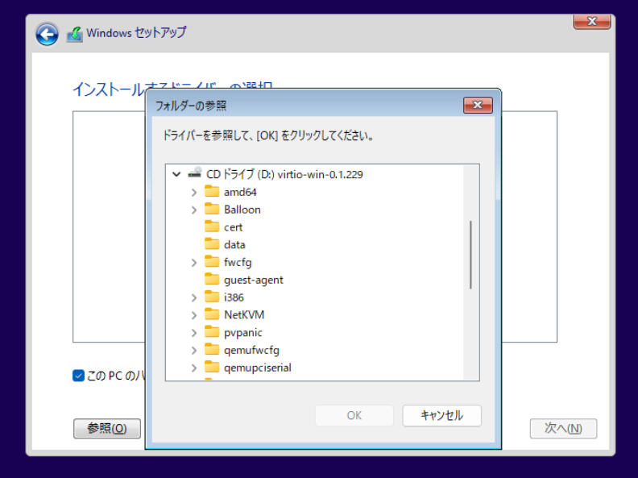  
ここで、ドライバの読み込み から先ほどのVirtIOのドライブを開き、ドライバをインストールする。  4

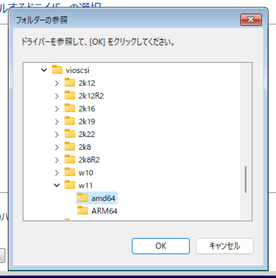  

まず最低限必要なのがストレージ用のドライバなので、
`CDドライブ(D:)virtio-win-x.x.xxx`から `vioscsi\w11\amd64` を選択しOKを押下。  

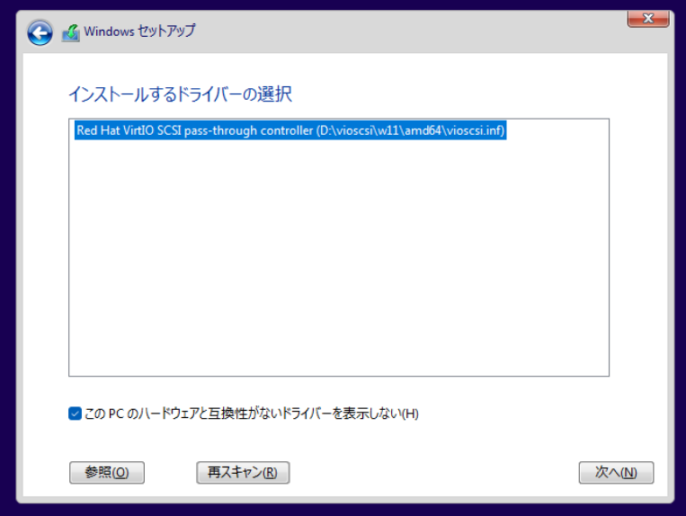  
`Red Hat VirtIO SCSI pass-through controller` が表示されていることを確認して `次へ` を押下。  

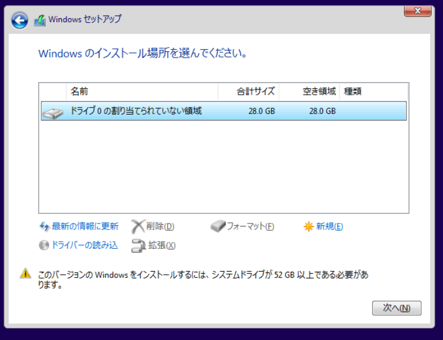  
これでストレージドライバがインストールされ、インストールドライブが表示されるはず。  

同じ要領でネットワークドライバと、メモリーバルーンを使いたい場合はBallooningドライバ、QEMUエージェントを利用する場合はIOドライバをインストール。  

ネットワークドライバの場合 `NetKVM\w11\amd64`、Ballooningドライバの場合 `Balloon\w11\amd64` のドライバ、QEMUエージェントを利用する場合は `vioserial\w11\amd64`をインストールすればOK。  
VM作成時にメモリーバルーンやQEMUの設定を有効にしなかった場合はドライバを選んでも `インストールするドライバーの選択` にドライバが表示されない。  

あとは普通にインストールを進めればOK。  


なお、QEMUエージェントを利用する場合はWindowsのインストール後別途別途QEMUエージェント自体のインストールが必要。  

`VirtIOのドライブ\guest-agent\qemu-ga-x86_64.msi` を実行すればOK。特にウィザードなどは出なかった。  

こちらの環境だとWindowsインストール段階でQEMUエージェントを有効にしない場合、Windowsインストール後にProxmox側の設定からQEMUエージェントを有効にするとWindowsが起動しないという問題にぶち当たった。  

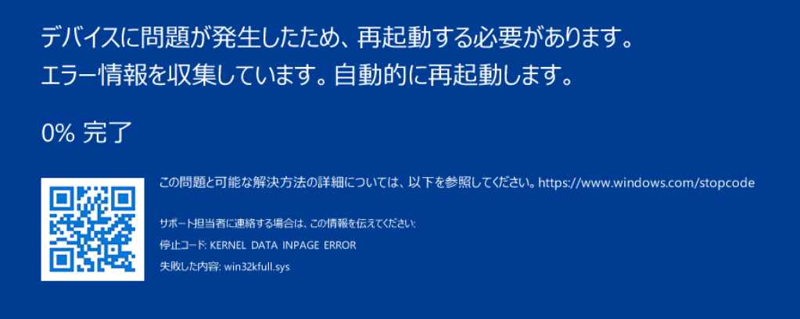  

多分何か方法が間違ってると思うものの、できればVM作成段階で有効にして、インストールをしたほうが良いと思われる。  

### トラブルシューティング 
#### `can't lock file '/var/lock/qemu-server/lock-[ID].conf' - got timeout.` と表示されてシャットダウンできない
上記のWindowsインストール前にQEMUエージェントを有効にせず、後から有効化してWindowsを起動した際、コンソールが完全に真っ暗な状態でにっちもさっちも動かず、あきらめてProxmox側からシャットダウンをした際に発生。  

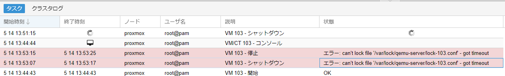  

どうもこういう時はシャットダウンをせず停止を選択したほうがうまくいったようなのだけど（シャットダウンはOSにシャットダウン命令をするので、OSがハングアップしてるとうまくいかない）、こうなってしまうと改めて停止を行おうとしてもロックファイルが邪魔をして停止すらできない。  

この場合、Proxmox側のコンソール側から下記のコマンドを実行し、改めて停止させるとうまくいった。  

```bash
rm /var/lock/qemu-server/lock-[VMのID].conf
qm stop [VMのID]
```


#### 別のストレージに仮想マシンイメージを移動したい  

間違えて予定していたストレージと違うところにVMを作成してしまったり、新しいSSDを取り付けたなどで移動したい場合。  

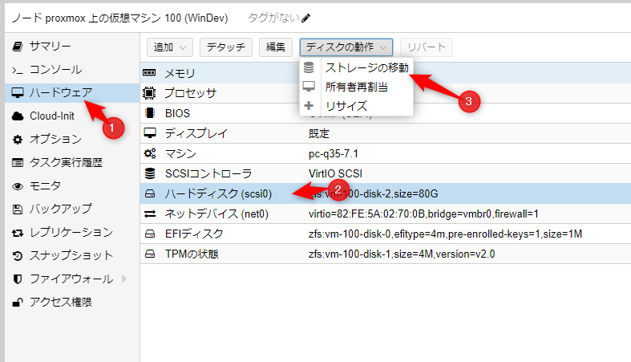  

移動したいストレージのVMを選択し、ハードウェアメニューを開く。  
VMが停止している状態で対象のストレージを選択した状態で上部のディスクの動作から `ストレージの移動` を選択。  

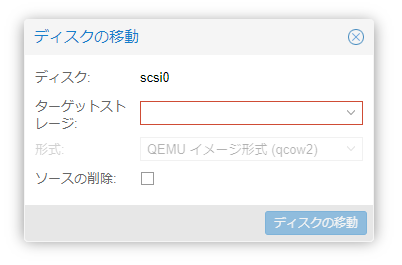  

ターゲットストレージから移動先のストレージを選択。  
コピーの場合は `ソースの削除` にチェックを入れず、移動する場合はチェックを入れる。  

あとは `ディスクの移動` を押下すると移動できる。  