ProxmoxではKVMを利用した仮想マシン作成だけでなく、LXCコンテナの作成も可能。  

LXCはまるで仮想マシンのようにそれぞれのコンテナ単位で独立したOSをインストールして構築するわけではなく、一つのLinuxカーネルを利用して複数の独立した環境を作ることができるため、リソースの消費が少ないのが特徴。  
またDockerとは違い1コンテナ当たり1プロセスというわけではないので、複数のプロセスを同時に動かせることがメリット。  

Dockerはアプリケーションの隔離環境で、LXCは軽量な仮想マシン環境というイメージ。  

<!-- more -->

### テンプレートのダウンロード

LXCは一つのテンプレートから作成するので、まずはテンプレートをProxmoxにダウンロードするところから。  

まずはProxmoxはテンプレートをGUIからダウンロード可能。  
ただしそのテンプレート一覧が古い可能性があるので更新を最初に実施。  

Proxmoxのシェルで下記のコマンドを実施。  

```bash
pveam update
```

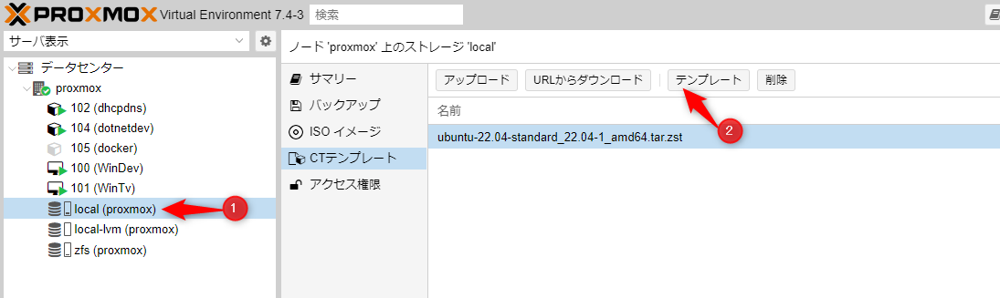
`local(host名)→CTテンプレート` から `テンプレート` ボタンを押下。  

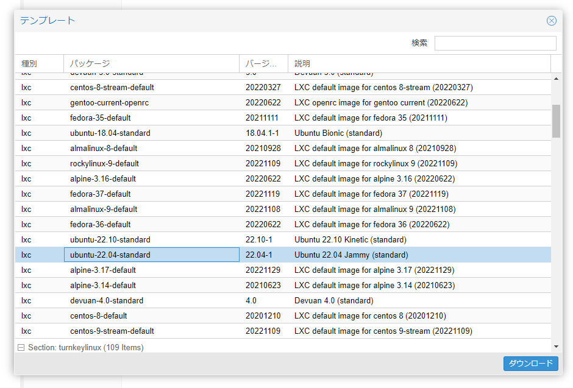

テンプレートのリストが表示されるので、利用したいテンプレートを選択。  
今回はUbuntu 22.10のテンプレートを選択。  

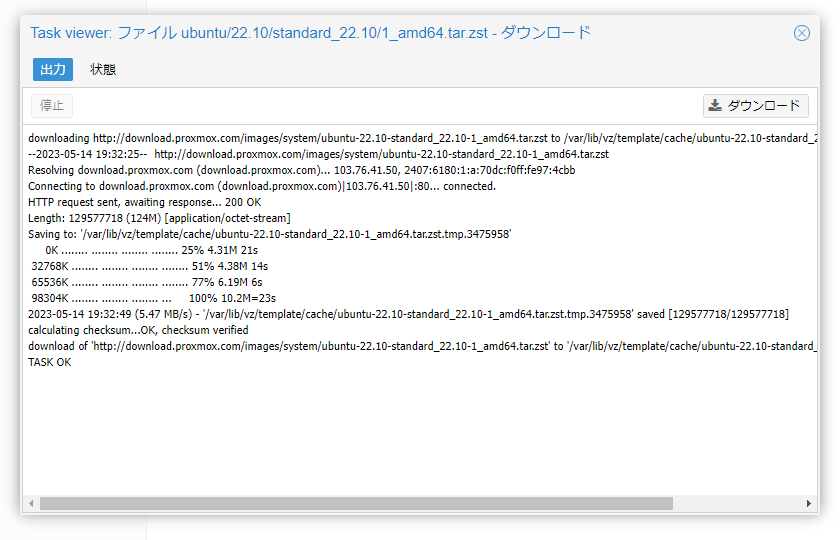

`ダウンロード`ボタンを押下するとProxmoxが自動的にテンプレートファイルをダウンロード、 `/var/lib/vz/template/cache` に格納してくれる。  

もちろんリストにないテンプレートも自分で用意すれば利用可能。  

下記の記事が詳しい。 

[oembed:"https://qiita.com/waigoma/items/762aa95e3d564d8955d4"]

### LXCコンテナ作成

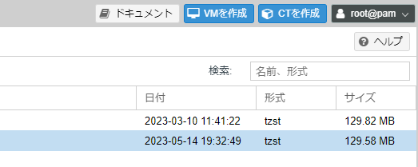

画面右上の`CTを作成` を押下。  

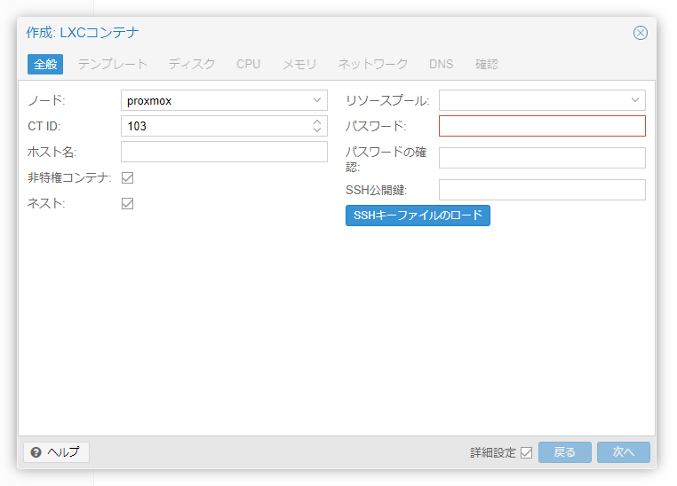

CT IDは自動的に発行される番号でOK。 
ホスト名は自分がわかりやすい名前を。  
基本的には非特権コンテナとしつつ、どうしても権限的に必要な場合だけチェックを外す。  
ネストはチェックを入れておくとDockerが起動できる。  

パスワードはログインする際のパスワードになるので必須入力。  
SSH公開鍵を設定しておけばProxmoxコンソールを利用せずとも好きなターミナルソフトでSSHログインできる。  

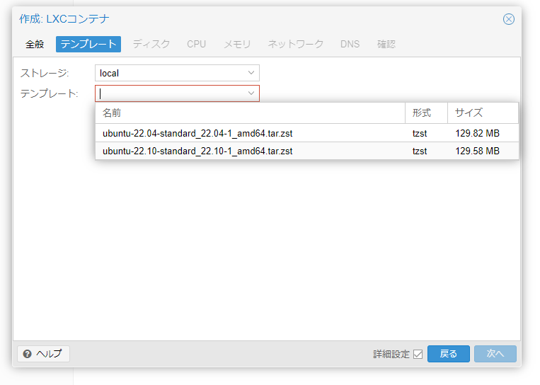

テンプレートから先ほどダウンロードしたテンプレートを選択。  

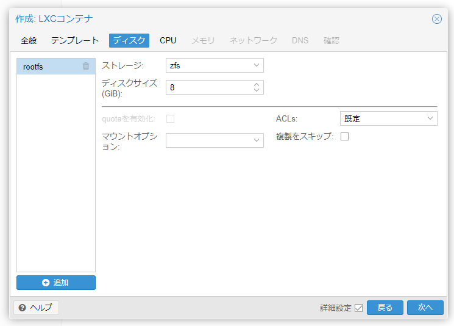

LXCを配置したいストレージの選択とサイズを指定。  

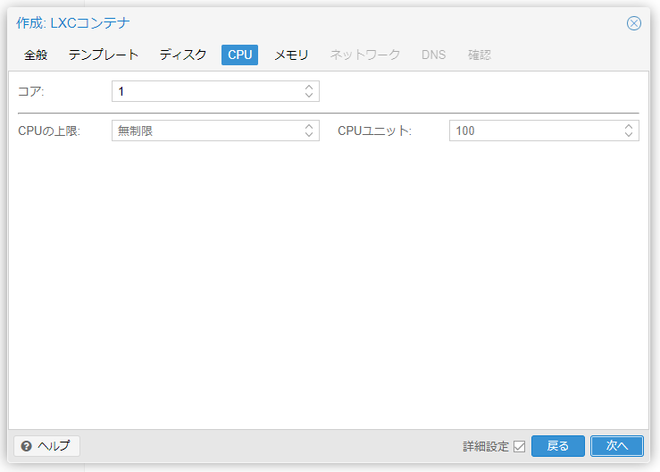
割り当てるCPUのコア数を指定。  

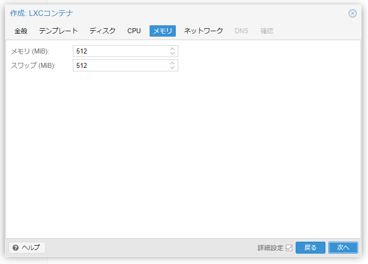

割り当てるメモリー量を指定。  

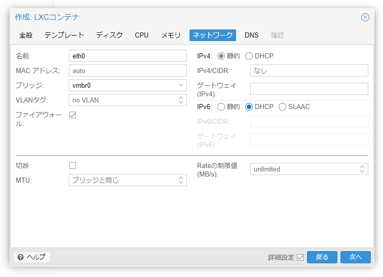

ネットワーク設定。  
IPアドレスをDHCPで割り当てる場合は `DHCP`に変更。  
指定したい場合はIPv4欄には `192.168.0.100/24` のようにCIDRまで指定。 

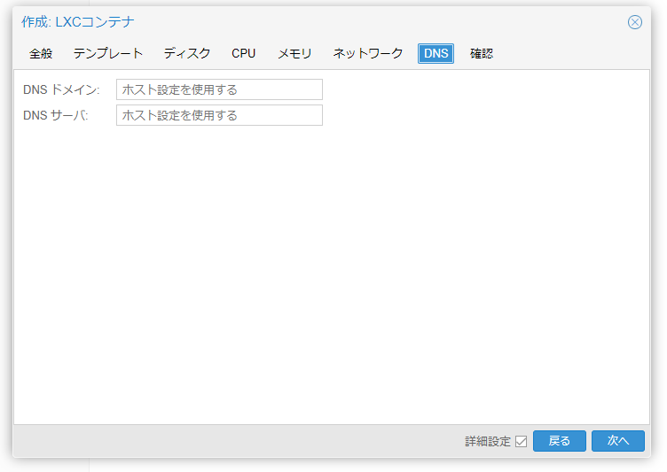
DNSの指定。  
基本的にはホスト設定を使用する形で何も入れなくてもいいはず。  

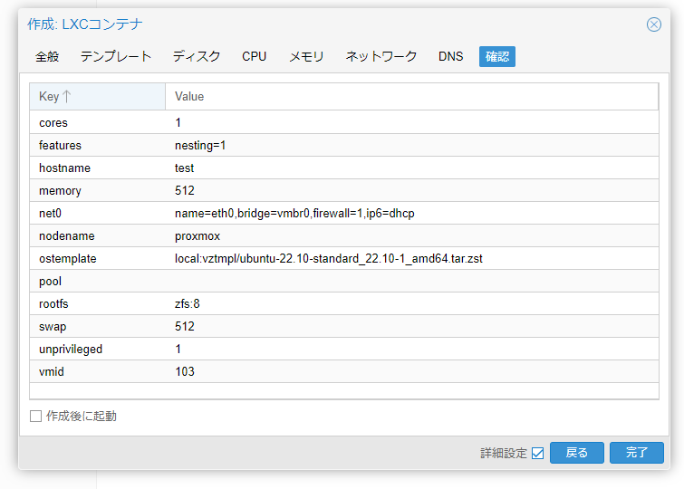
設定内容の確認。  
問題なければ `完了` ボタンを押下。  

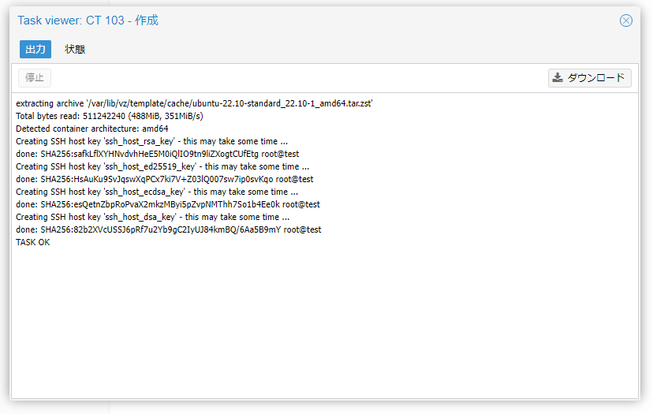

テンプレートが展開され、コンテナが作成される。  

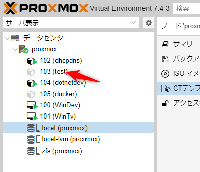

コンテナが作成され、メニューに表示された。  

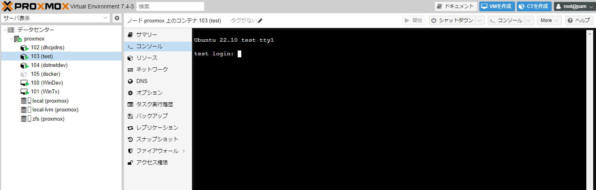

作成したコンテナを選択した状態で右上の`開始`ボタン押下でコンテナ起動。  

あとは普通に利用するだけ。 ログインユーザーはroot。  
必要に応じてユーザーを作成するなり肉なり焼くなり。  


### 参考
[oembed:"https://qiita.com/onokatio/items/969e3b470359e4c47a04"]

[oembed:"https://qiita.com/waigoma/items/762aa95e3d564d8955d4"]