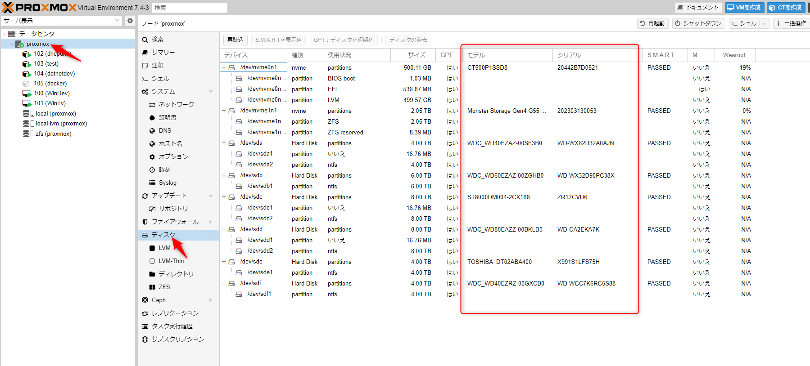
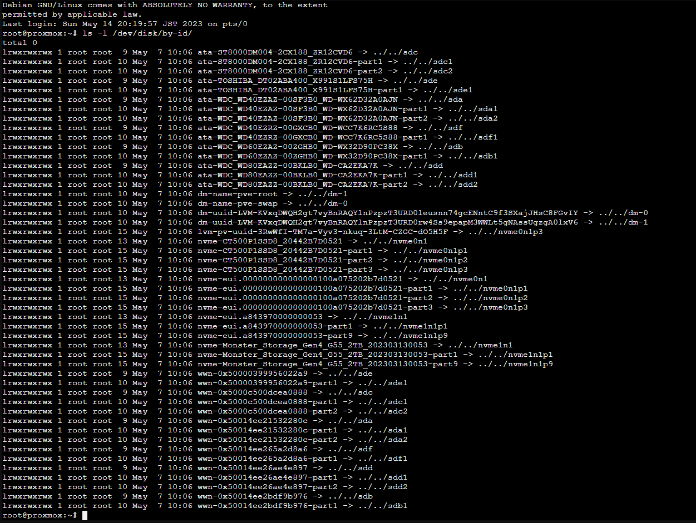
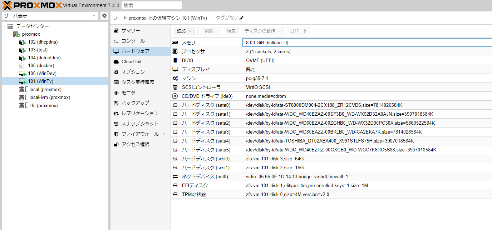

今回構築したProxmoxマシンは録画マシンも兼ねているため、大容量HDDを直接VMから読み書きできるようにしたい。  

VMware ESXiの頃はRDMの設定を行って直接読み書きできるようにでき、10年近く前にブログ記事にまとめていた。  

[oembed:"https://blog.hitsujin.jp/entry/2014/06/08/161357"]

Proxmoxでも同じように設定できたので覚書き。  

### パススルー接続するストレージのメモ  



`(ホスト名)→ディスク` からマシンに接続されているストレージの一覧が表示されるので、対象となるストレージのモデル名とシリアル番号をメモ。  

ただ、このリストからメモをするよりはProxmoxのシェル側で下記のコマンドを実行して取得したほうが何かと楽。  

```bash
ls -l /dev/disk/by-id/
```


### コマンドでセット

パススルーで見せたいVMのIDを確認したうえで下記のコマンドを実行。  

```bash
qm set [VMのID] -[virtio,sata,scsi][数値] /dev/disk/by-id/[ストレージの情報]
```

`-[virtio,sata,scsi][数値]` の数値の部分は0からSATAなら5、virtioは15、SCSIなら30 までの範囲で自由に設定可能。  
同じ番号で別のストレージを設定すると上書きされてしまうそうなので注意。  
参考にさせてもらったページではvirtioで行っていたけれど、当方環境では認識されず。  
多分ドライバの設定とか別の要因。環境再構築する際にまた確認したい。  

ストレージの情報の部分は下記の構成。  
```
ata-[モデル名]_[シリアル番号]
```
CLIで取得した場合はこの構成で取れるので、CLI側から確認するのがおすすめ。  

当方の環境でのコマンド例。  

```bash
qm set 101 -sata0 /dev/disk/by-id/ata-ST8000DM004-2CX188_ZR12CVD6
qm set 101 -sata1 /dev/disk/by-id/ata-WDC_WD40EZAZ-00SF3B0_WD-WX62D32A0AJN
qm set 101 -sata2 /dev/disk/by-id/ata-WDC_WD60EZAZ-00ZGHB0_WD-WX32D90PC38X
qm set 101 -sata3 /dev/disk/by-id/ata-WDC_WD80EAZZ-00BKLB0_WD-CA2EKA7K
qm set 101 -sata4 /dev/disk/by-id/ata-TOSHIBA_DT02ABA400_X991S1LFS75H
qm set 101 -sata5 /dev/disk/by-id/ata-WDC_WD40EZRZ-00GXCB0_WD-WCC7K6RC5S88
```


実行するとこんな感じでVMのハードウェア一覧に表示される。  


### 参考
[oembed:"https://nofu.jp/wiki/virtualization/proxmox_ve_6_2_rdm"]