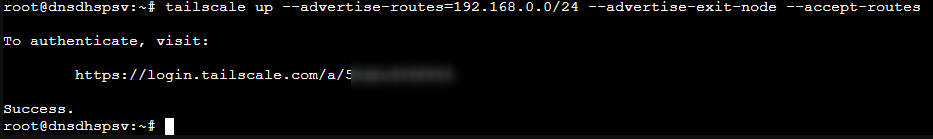
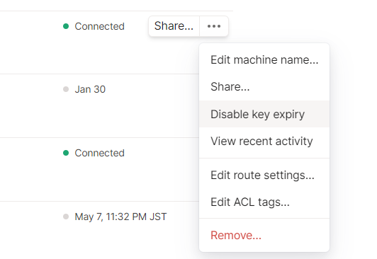
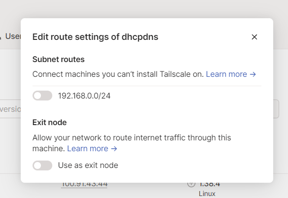
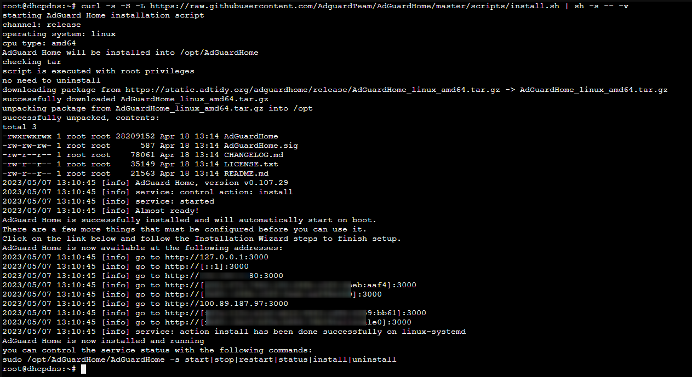
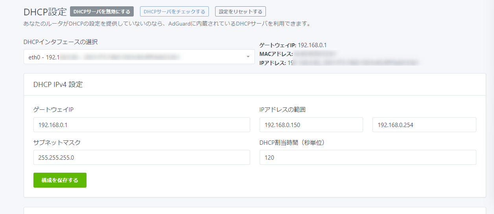
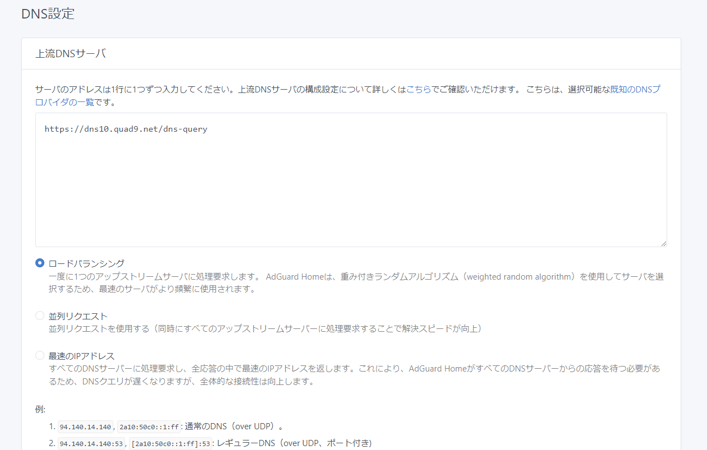
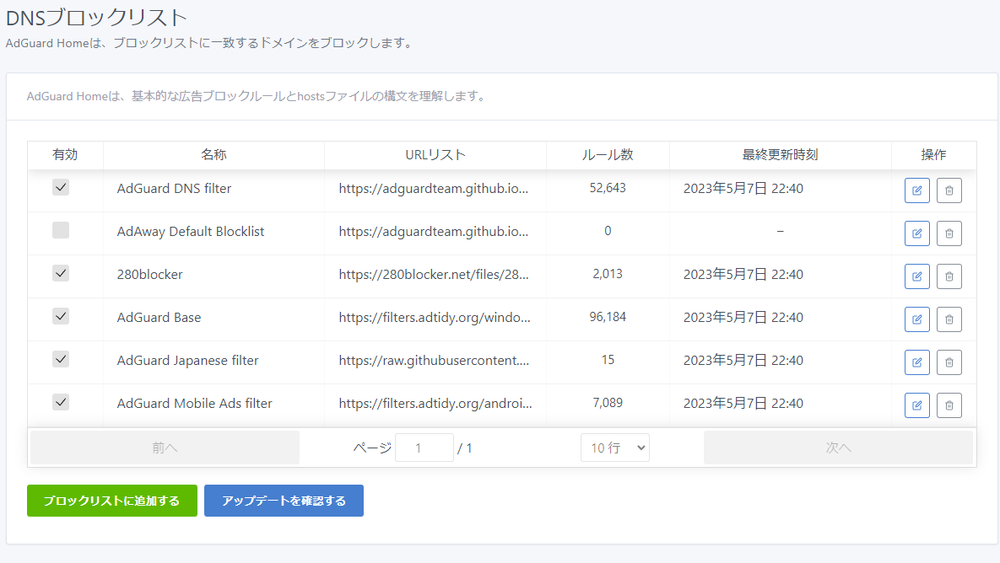
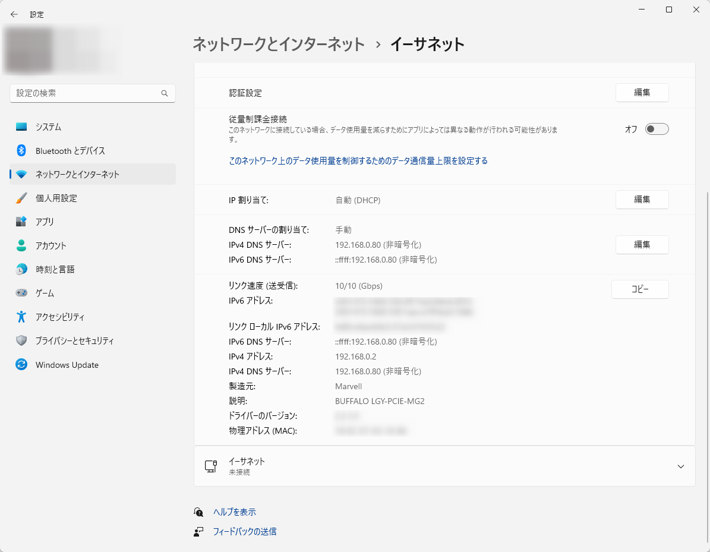
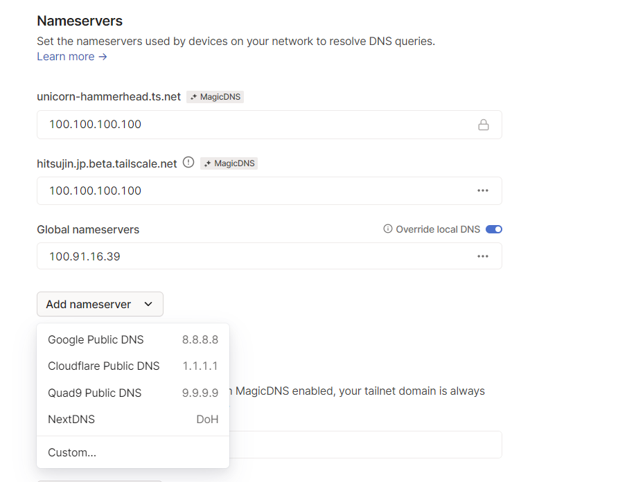
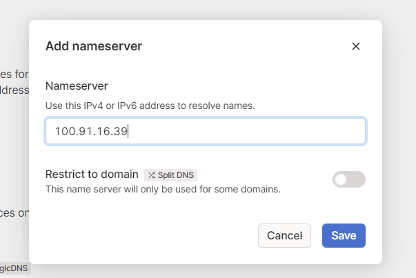

これまでRaspberryPi上にISC DHCPをインストールして自宅内DHCPサーバーを運用してたんですが、USBメモリーブートのRaspberryPiだと長期間運用が厳しく、かといってこのためだけにUSB接続のSSDを導入するのももったいない。  
今回仮想化プラットフォームのProxmoxを導入したので、この機会に環境を一新。  

今回はただDHCPサーバーを構築するだけだとつまらない（？）ので、
- DHCP機能
- DNS機能
- 広告ブロック機能
- VPN機能

を持ったサーバーを立ち上げることに。  

というわけで、AdGuard HomeをインストールしてDHCP、DNS、広告ブロックを行いつつ、Tailscaleで自宅の外から広告カットできるVPN接続を行える環境構築。  


### LXCコンテナの作成  
コンテナの作成方法自体は別途記事を書いているのでそちらを参照。  

LXCの設定

### Tailscaleのインストール

コンテナ側の定義ファイルをまず変更。  
Proxmox側のシェルに入ってから、下記のコマンドを実行。  
CTIDは今回のLXCコンテナのIDに書き換えること。  
```bash
CTID=[コンテナのID]
CTID_CONFIG_PATH=/etc/pve/lxc/${CTID}.conf
cat <<EOF >>$CTID_CONFIG_PATH
lxc.cgroup2.devices.allow: c 10:200 rwm
lxc.mount.entry: /dev/net/tun dev/net/tun none bind,create=file
EOF
```

実行したら今度はコンテナ側のコンソールで下記を実行し、Tailscaleをインストール。  

```bash
curl -fsSL https://tailscale.com/install.sh | sh
```

Tailscaleをインストールし終わったら一度コンテナを再起動。  

exit nodeを使う場合は下記コマンドを実行してIPフォワーディングを有効化する必要あり。  

```bash
cat <<EOF >>/etc/sysctl.conf
net.ipv4.ip_forward = 1
net.ipv6.conf.all.forwarding = 1
EOF
sudo sysctl -p /etc/sysctl.conf
```

コンテナのコンソールで下記のコマンドを実行。  

```bash
tailscale up --advertise-routes=192.168.0.0/24 --advertise-exit-node --accept-routes
```

Tailscale利用中にローカルネットワーク内のTailscaleをインストールしていないマシンにアクセスしたい場合は `--advertise-routes` を設定。IPアドレスは各自の環境に合わせること。  

exit nodeが不要なら `--advertise-exit-node --accept-routes` のオプションは不要。  
屋外でこのコンテナからインターネットに出るための設定なので、この設定をしておいたほうが屋外で安全にインターネットを使えて便利。  

単純にTailscaleを使いたいだけなら `tailscale up` だけでOK。  

上記コマンドを実行するとURLが表示されるのでブラウザで開いて認証を行う。この辺りは以前まとめたブログ記事を参照。  



<?# OEmbed "https://blog.hitsujin.jp/entry/2022/01/18/120000" /?>

Tailscaleが立ち上がったらキーが失効しないよう[Machines](https://login.tailscale.com/admin/machines)を開き、該当のマシンのメニューから `Disable key expiry` をしておくこと。



また、Exit Node(`--advertise-exit-node`)、SubnetRoute(`--advertise-routes`)を利用する場合は `Edit route settings`からそれぞれのオプションを有効にしておくこと。  



### AdGuard Homeインストール

先にUbuntuの `systemd-resolved` が提供する `Local DNS Stub Listener ` を無効化しておく。  
これをやっておかないと 53/udpを `systemd-resolved`がlistenしたままになって困るので。  

`/etc/systemd/resolved.conf` を開いて下記のように編集。  

```bash
[Resolve]
DNSStubListener=no
```

設定を変えたら次は `/etc/resolv.conf` を削除後、 `/run/systemd/resolve/resolv.conf` にシンボリックリンク設定。  

```bash
sudo rm /etc/resolv.conf
sudo ln -s /run/systemd/resolve/resolv.conf /etc/resolv.conf
```

これが終わったら`systemd-resolved`を再起動し上記設定を反映。  

```bash
sudo systemctl restart systemd-resolved
```

前設定が終わったので公式サイトの記載通り
```bash
curl -s -S -L https://raw.githubusercontent.com/AdguardTeam/AdGuardHome/master/scripts/install.sh | sh -s -- -v
```

を実行。  
curlがインストールされていない場合は `apt install curl`を実行してから。  



展開が完了したら画面に表示されているURLをブラウザで開き、インストール作業を続行。デフォルトで日本語対応しているので楽。  

設定が必要な個所はIDパスワードくらい。
パスワードの変更がブラウザ設定画面で提供されてないので、パスワードを忘れない範囲で複雑なものにしておくべし。  

### AdGuard Home設定

#### DHCP機能有効化


上部メニューからDHCP設定を開く。  

DHCPインターフェースの選択で対象となるインターフェースを選択し、DHCP IPv4設定、IPv設定を行い、DHCPサーバーを有効にするのボタンを押下して有効化。  

なお、有効化したらすぐにルーター側のDHCP機能も無効化すること。  
同一ネットワークに複数のDHCPサーバーが同居するのはNG。

#### DNS設定
標準では上流DNSサーバーとして `Quad9` のDNSサーバーが指定されている状態。  



ここはお好きに設定すればOK。  
DNS over HTTPSが利用できるので、例えばGoogle Public DNSを利用したい場合は `https://dns.google/dns-query` を指定。  

#### DNSブロックリスト


広告ブロックの胆。  
AdGuard標準のブロックリストだけだと日本国内の広告に対処できなかったりするので、280Blockerなどが提供してるフィルターをセット。  

`ブロックリストに追加する`ボタンを押下し、 `カスタムリストを追加する` からフィルターURLを保存すればOK。  

なんJ AdGuard部 Wikiなどを参考にリスト追加。  
悪質な広告だけをブロックするフィルターがあるといいのだけど。  

<?# OEmbed "https://wikiwiki.jp/nanj-adguard/%E3%83%95%E3%82%A3%E3%83%AB%E3%82%BF%E3%83%BC%E3%83%AA%E3%82%B9%E3%83%88" /?>

### ルーター・WindowsのDNS設定

ルーター側でプライマリDNS設定が存在する場合はそこを設定してしまえばネットワークにつながっているすべての機器でAdGuard Homeによる広告ブロックの恩恵が受けられる。  

ルーター側が対応していない場合でもDHCPサーバーがDNSサーバーの情報を広告してくれるので、スマホではAdGuard HomeのDHCP機能を有効化している場合何もしなくてもOK。  

Windowsの場合でも広告されるものの、私の環境だとIPv6だけルーター側のDNSサーバーが優先されてしまったため、手動で設定。  

`ネットワークとインターネット`から `DNSサーバーの割り当て`の編集ボタンを押下して設定を変更。  

IPv4にはDHCPサーバーのIPアドレスをそのまま、IPv6側はDHCPサーバーにIPv6のIPアドレスがあるならそれを、ない場合はIPv4射影アドレスを設定すればOK。  

例えばDHCPサーバーのIPv4アドレスが `192.168.0.100`であれば `::ffff:192.168.0.100`と設定。



### Tailscale側のDNS設定
屋外で広告ブロックしたい場合のキモの設定。  
DHCPサーバーにインストールしたTailscaleのIPアドレスをメモっておき、[TailscaleのDNS設定画面](https://login.tailscale.com/admin/dns)を開く。  

`Add nameserver` の`Custom` を選択。  


Nameserverの項目に先ほどメモっておいたIPアドレスを入力してSave。


`Override local DNS` の設定も有効化しておくこと。

これで屋外でも広告ブロックされる。  

### 参考

<?# OEmbed "https://eginoy.com/tailscale%E3%82%92%E5%88%A9%E7%94%A8%E3%81%97%E3%81%A6%E5%A4%96%E5%87%BA%E5%85%88%E3%81%A7%E3%82%82%E5%BA%83%E5%91%8A%E3%83%96%E3%83%AD%E3%83%83%E3%82%AF/" /?>

<?# OEmbed "https://note.com/klayer123/n/n02c3b6f8cde3" /?>

<?# OEmbed "https://www.330k.info/essay/ubuntu-softether-adguardhome-dns-setting/" /?>

<?# OEmbed "https://qiita.com/shora_kujira16/items/31d09b373809a5a44ae5" /?>

<?# OEmbed "https://eginoy.com/tailscale%E3%82%92%E5%88%A9%E7%94%A8%E3%81%97%E3%81%A6%E5%A4%96%E5%87%BA%E5%85%88%E3%81%A7%E3%82%82%E5%BA%83%E5%91%8A%E3%83%96%E3%83%AD%E3%83%83%E3%82%AF/" /?>