SSHの秘密鍵、皆さんどうやって管理されてるんでしょう。  

私はこれまで秘密鍵についてはCryptmatorを使って暗号化したうえでOneDriveに保存するようにしていました。  
これだと複数マシンで楽に利用できますし、Cryptmatorの仮想ドライブ機能で復号したファイルを参照できるのでいちいちファイル暗号化、復号を行う必要がないわけです。  

ここ数年はこれで問題なく運用してきましたし、別にこれで困ったことはありません。  

ただ、普段パスワード管理で利用している1PasswordにSSHエージェント機能が搭載され(2022年のv8.6で)、わざわざ秘密鍵をファイルとして管理しなくとも、統一的かつ安全に管理することができるようになったので、重い腰を上げてそちらに置き換えることにしました。  

<!-- more -->

[oembed:"https://forest.watch.impress.co.jp/docs/news/1396447.html"]

なお、この記事はWindows環境に特化した内容になってます。  
LinuxやMacは多分もっと簡単かつ他にも記事が多くあるのでそちらをご参照ください。  

## 前提

1PasswordのSSHエージェント機能は
- 1Password 8.7以上
  - サブスク契約必須
- Windows Hello対応マシン

が利用条件。  

## 1Password側のSSHエージェント機能有効化

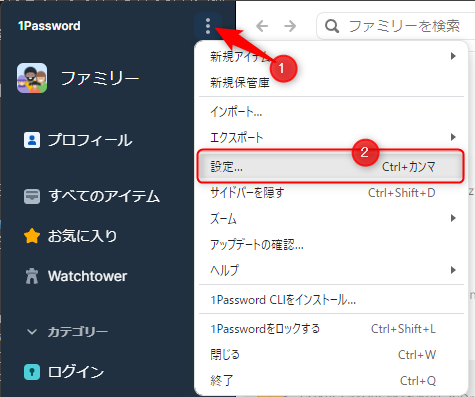

1Passwordの左上にある三点アイコンをクリックしてメニューを開き、設定を開く。  

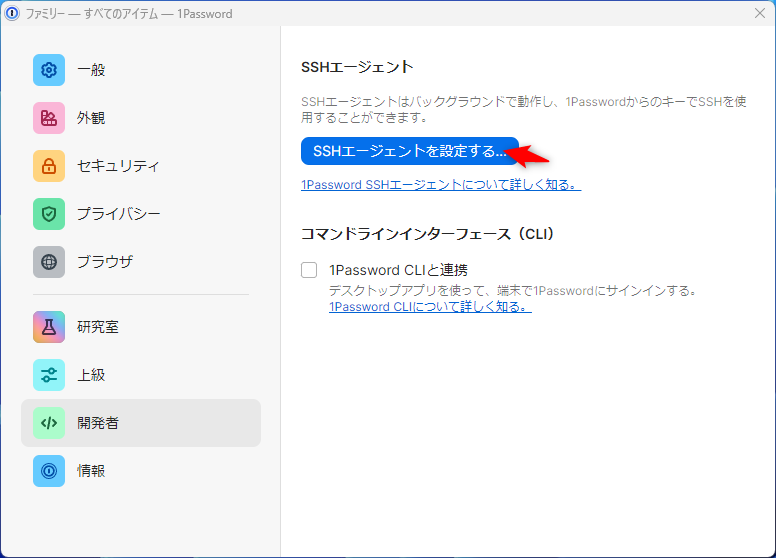


開発者メニューから `SSHエージェントを使用する` をクリック。

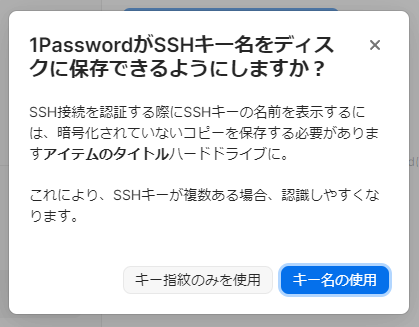
SSHキー名をディスクの保存するようにするか聞かれるのでお好きなほうを。キー名はあったほうが確実にわかりやすい。 

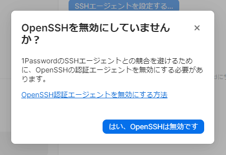
1PasswordのSSHエージェントを利用するにはOpenSSH側(Windows 11は標準搭載)の認証エージェント機能を無効化する必要があるため、確認ダイアログが表示される。  
この後で無効化するのでいったん `はい、OpenSSHは無効です`をクリック。  


## OpenSSH のサービス停止  


サービス管理を開いて `OpenSSH Authentication Agent` のサービスを停止、手動起動または無効に切り替え。  

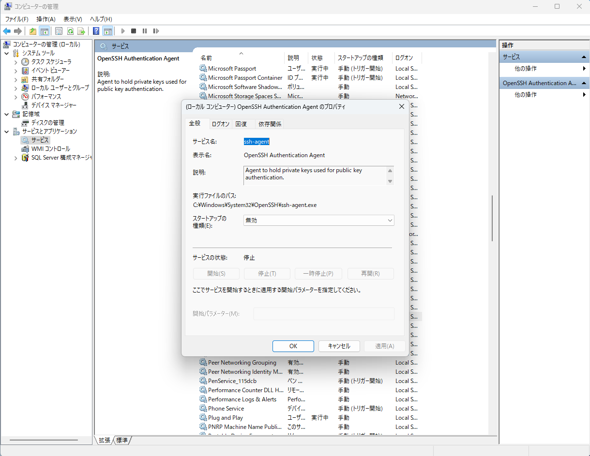


## Git向け設定  
下記のコマンドをターミナルで実行。  

```batch
git config --global core.sshCommand "C:/Windows/System32/OpenSSH/ssh.exe"
```
または.gitconfigに直接
```ini
[core]
  sshCommand = C:/Windows/System32/OpenSSH/ssh.exe
```
を記載してもOK。

## WinSSH-Pageant のインストール  


1PasswordのSSHエージェント機能はOpenSSHのSSHエージェントと同じ規格で通信を行うようです。  
コマンドプロンプトやPowerShellでSSH接続する分にはそれで行けるんですが、Windows向けのSSHソフトウェアは多くがPuttyのPageantの規格を利用しているようで、私が利用しているRLoginやWinSCPでは利用できません。  

そこで登場するのが WinSSH-Pageantです。  

[oembed:"https://github.com/ndbeals/winssh-pageant"]

OpenSSHのSSHエージェント(今回は1PasswordのSSHエージェント)とPageantをサポートしているSSHソフトウェアの間でプロキシとして動いてくれるソフトです。  

これを入れればPageantをサポートしているソフトウェアでも1PasswordのSSHエージェント機能が利用できます。  

インストールは上記サイトからMSIインストーラをダウンロードしてインストールするか、自分でビルドをするか、WinGetを利用してインストールするかです。  
MSIインストーラまたはWinGetだとスタートアップにも自動的に登録してくれるのでお勧め。  

```batch
winget install winssh-pageant
```


## 実際に使ってみる  

これで利用できるようになったはずなので、実際に利用してみます。  

### RLogin

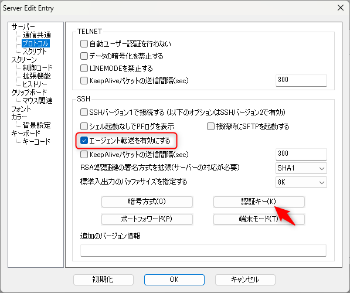

SSHエージェントを利用したいサーバーのオプションを開き、プロトコルメニューの `エージェント転送を有効にする` にチェックを入れ、 `認証キー` のボタンを押下。  

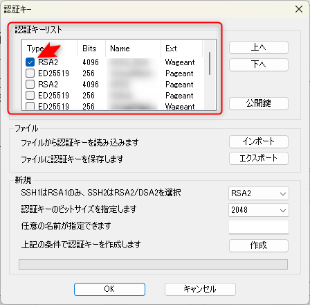

認証キーリストに、1Passwordに登録されているSSHキーの一覧がずらずらと表示されるはず。  
必要なキーにだけチェックを入れ、OKを押下。これで設定は完了。  

これでサーバーに接続しようとすると

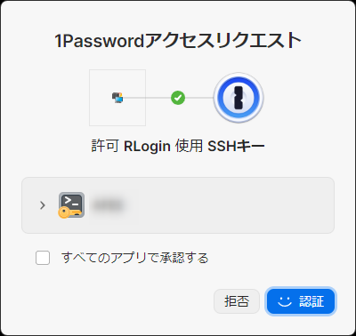

こんな感じで1PasswordがSSHキーをRLoginで使用させて良いか聞いてきます。  

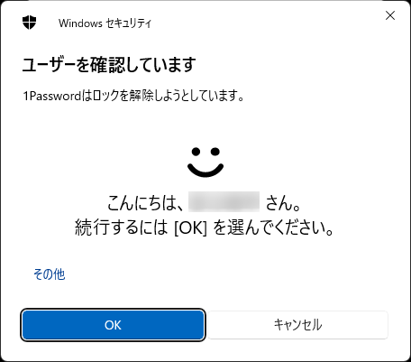

OKなら認証ボタンを押すと、Windows Helloが認証をしろと言ってくるので顔認証なり指紋認証なりPIN認証なりで認証してやるとログインできます。  

### WinSCP

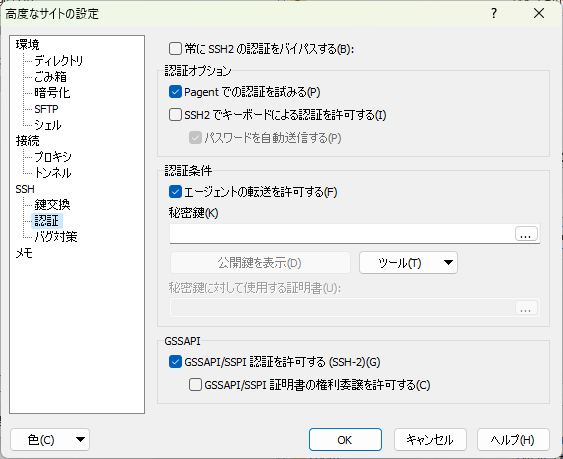

WinSCP側もRLoginとそんなに変わらず。  
サーバー設定の認証オプションから `Pageantでの認証を試みる` にチェックを入れるだけ。RLoginのようにどのSSHキーを利用するかを選択する必要はなし。  

ログインするときはRLoginと同じく1Passwordがウィンドウを出してくるので認証してやればOK。

### GitKraken  

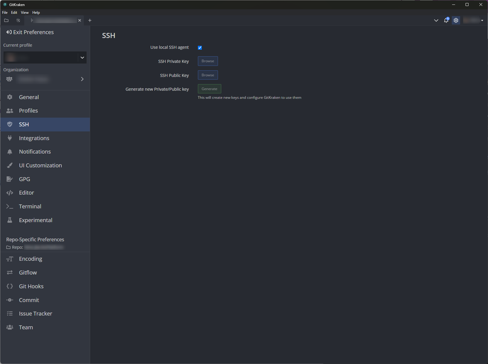

PreferencesのSSHメニューから、 `Use local SSH agent` にチェックを入れる。  


## 参考サイト
[oembed:"https://developer.1password.com/docs/ssh/get-started/"]

[oembed:"https://hiro20180901.com/2023/02/13/keepassxc-ssh-agent-pageant-software-and-git-for-windows/"]