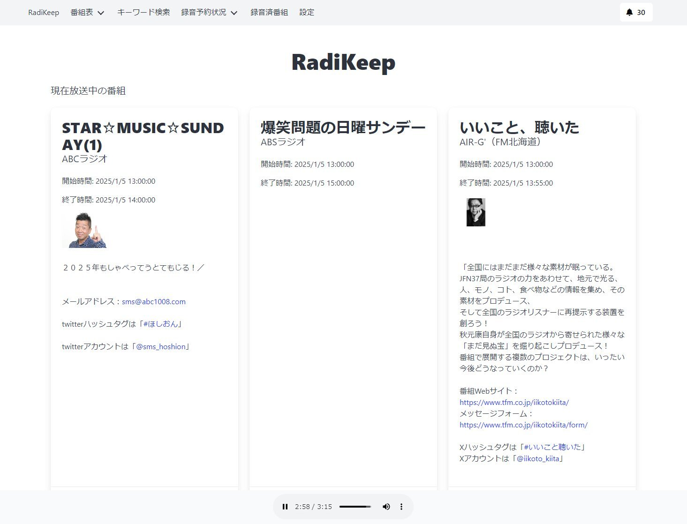
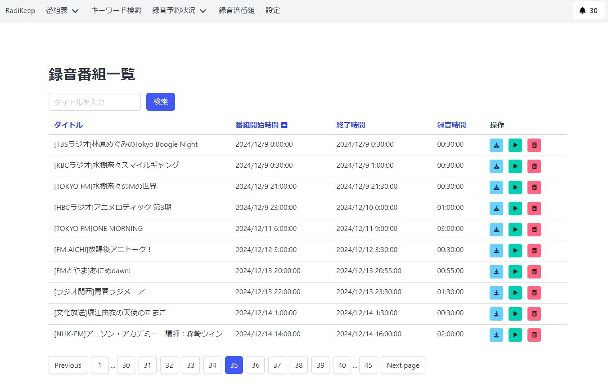

とっくに2025年になってますがあけましておめでとうございます。  

<!-- more -->

昨年はほとんどブログを更新することもなく、久しぶりにブログを更新するかぁと思って記事を書いたものの、Statiqでうまくビルドできず更新に失敗する状況を放置してしまい、結局1月に更新したっきり。  

今年はもう少しブログでのアウトプットを増やそうかと思っています。  

## 趣味プログラミング  

ここ最近はradiko、らじる★らじるなどのオンラインラジオ配信サービスの番組録音のツールを趣味で作成しています。  
自分しか使わない前提で作っていたのに、せっかくだからあれも実装しようこれも実装しようと思っているうちに機能が変に膨れてしまい、せっかくなので公開しようかと思って調整中です。  

## 資格

昨年久しぶりに なごあず という名古屋のAzure系勉強会に参加したのですが、そちらでお会いした方が私とほとんど年が変わらないなかで大変博識で、ちょっと己の力量不足を感じたこともあり、今一度リファレンスなどを読み込んだうえでAzureの認定資格を取るくらいはしようかなとも。  

また、今年は 第二種電気工事士の資格を取ろうかと思って勉強中です。  
今住んでいる家のコンセントなどをいろいろいじりたいと思ってたので資格を取ろう取ろうと思っていたものの、なかなか進められていなかったのですが、楓月さんから一緒に勉強しようぜとお誘いいただいたので重い腰を上げて勉強中。  

