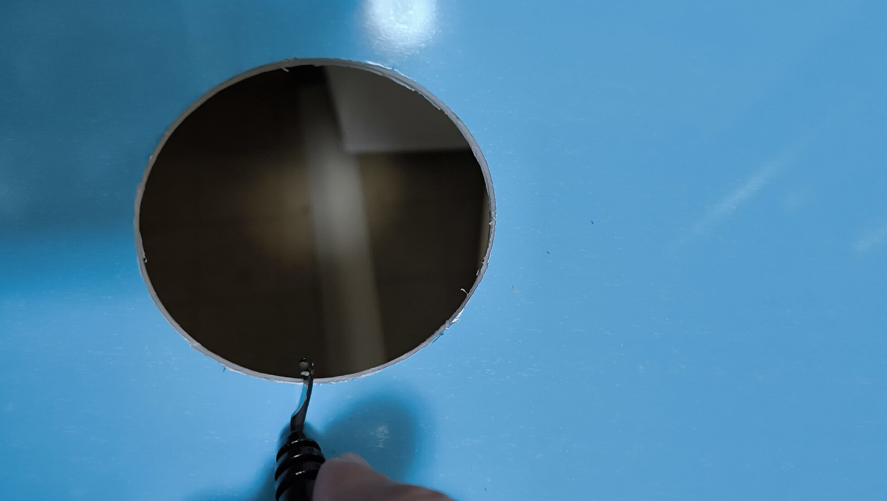

### シンク下の床板がボロボロ

今住んでいる家は伯母の持ち家。  
以前は伯母の両親が住んでたんですが、亡くなられて空き家になってしまい、腰を痛めている伯母が管理するのは厳しいということで、私が管理しながら住んでいる状況。  

そんな家なんですが、前々から台所のシンク下収納に問題がありました。  
どうもシンクから水漏れしている模様。  

収納棚についている茶色い汚れがシンクからこぼれたと思われる水汚れ。
普段は漏れてなくて何かの拍子に漏れている様子。    
そして水漏れをたびたび起こしていたことで床板もボロボロになってました。写真だとわかりづらいですが、もうぶかぶか。  
さらに排水のパイプが流し台の穴の位置からずれているので結構無理やり排水ホースを引っ張っていて、防臭キャップがきちんとはまっていないのか、下水の匂いがほんのりする状況。  

こんな状態だったのであまりものを入れておく気にはなれず、ほとんどこの収納を使ってませんでした。  

7年近くこの家で生活してきて、さすがにこれ以上この状況を放置しておきたくないなと思い、最初は流し台ごと新しいものに交換することを検討。  

ただ、本体だけでも安くて5万円くらいかかり、業者に頼んだら二桁万円。DIYで取り付けまでやるにも、デカ物なのでさすがに一人だと厳しい。  
というわけで、できる範囲で交換だけすることに。  

<!-- more -->

### 材料探し
まずは床板をどうするかから検討。  
全部はがして板を張り替えるのが一番きれいなんでしょうけど、そこまでスキルは無く失敗する未来しか見えなかったので、ボロボロのところを切断したうえで、上から板材をかぶせることに。  

最初はその辺のホームセンターで手に入る木製の合板とかに防水加工をして対応しようかと考えてたんですが、たまたま立ち寄ったコメリProでアルミ複合板を発見。  

防水加工を自分でしなくともこれなら屋外使用前提で水に強く、カッターで裁断も可能。  
何より薄くて頑丈。上からかぶせて使うことを考えると厚みはないほうが助かる。  
木材だと薄いものはへにゃっとするし反りがあるので、その点でもこちらのほうが優位。  

というわけでこれを購入。  

今回の問題の根幹である水漏れについては、流し排水栓の交換で対応。  
水が漏れ出しているのは排水ホースからではなく流し排水栓とシンクの隙間からであることがわかったので、最初はパッキンだけを変えようかと思ったものの、本体も1950円とそれほど高くもなかったので丸ごと交換することに。  

[amazon:B003PHIXFY]

### 流し排水栓の交換

まずは排水栓の交換から。  
商品の箱に取り付け方の記載があったのでその通りに。  

先に排水ホースを本体から取り外します。  

次に古い排水栓を取り外します。本体のトラップに水が溜まっている場合は先に水を捨てておくか水がこぼれても良いように下に雑巾などを置いておきましょう。  
プロの方は以下の専用の工具を使って取り外しているようです。  

[amazon:B008J8QWS4]

ない場合は頑張って力技で取り外すか、金づちとマイナスドライバーを使って取り外すとかする必要があります。  
今回購入したものは排水金具を取り外すためのちょっとした道具もついていたので、それで事足りました。

排水栓を取り外したところ。  
排水栓のパッキンがシンクにべったりくっついてボロボロに。錆も出てる状況。  
きれいに汚れなどは取り除いておきます。  
後述しますがこのときに排水口に小さな穴（ピンホール）が開いていないか確認しておきましょう。  

新しい本体から口金を取り外します。  
本体側の灰色の物体はスベリパッキン。紙製。  

新しいパッキンを取り付けて口金を置き、裏から本体を取り付けます。  

取付が終わったら本体に排水ホースを取り付け。  
長すぎたので適当な長さでカットしました。  

本体にホースを取り付けてから排水プレート（以前のものを再利用した）をはめて、新品の防臭キャップを取り付けて排水パイプに取り付け。  

取り付けたら水漏れがないかどうかチェック。  
このとき、まずは少量の水を流して水漏れしていないかを確かめて、そのあと一度シンクに水をためて水漏れが起きないかを確認しておくことをお勧めします。そうしないと後述のような事態になります・・・。  

### 床板DIY

流し排水栓の交換が終わったので今度はシンク下の床を何とかしていきます。  

まずはボロボロになっていた合板をカットするところから。（排水栓交換より先に行った）  
状況把握もしておきたかったので広めにカット。  
下水臭の原因は防臭キャップの劣化で亀裂が入っていたためだった模様。  

床のサイズを測ってアルミ複合板をカットしていきます。  
本当は一枚板をばこんとはめ込める形にできたらよかったんですが、流し台の扉や柱とかがあってそのままでは入らないので、いくつかに分割することに。  

計ったサイズであらかじめ線を引いておいたので、カッターナイフで何度もなぞって切り取ります。  

サイズ確認のために一度はめ込んだところ。  
まだ排水栓用の穴はあけてません。  
レーザー距離計を使って計測したのでほとんど狂いなくカットできた模様。 

排水ホースを通すための穴をあけていきます。  
先ほど仮で取り付けた際に排水パイプの正確な位置を把握したので、その場所に合うように穴を開けます。  
以前暗渠排水を作る際に購入したホールソーがここでも役に立ちました。  

[amazon:B07RHSK6HD]

ホールソーで空けた穴はバリがついていて危ないので、これまた暗渠排水を作る際に排水パイプの面取りで使ったスクレーパーを使ってバリ取りをしておきました。  

[amazon:B00TO9PJF4]

改めて仮置き。  
写真じゃわからないですけど排水パイプの真上にいい感じに収まりました。  

問題なさそうなので板材を取り付けてしまいます。  
置くだけでも良いんですが、一応両面テープも使うことに。  

はめ込んだら保護用のビニル材をはがします。  

良い感じ。  
分割した以上どうしても隙間が生まれてしまってるんですが、床材の上にニトリで売っている防虫シートを敷くので問題なし。  

### まだ水漏れしている？
これでDIY完了！と思ってたんですが、この後食器を洗い終わってから確認したところ、ぽつぽつと水滴が落ちているのを発見。  

まじかーと思いながらもう一度排水栓を取り外し、確認。  
取付自体は間違ってなかったのですが、シンクをよく見てみたところ。  

こんな感じで排水口にピンホールが開いていることが発覚。  
ステンレス製のシンクですが、長年の利用で腐食してきている模様。  
錆のある底面だけでなく、側面にも空いてました。そりゃパッキンを置いたところでパッキンが当たってないんですから水も漏れますわ・・・。  

本来ならここまで来たら流し台交換をするべきなんでしょうが、そんな金もない。  
同じような事案は検索すると出てくるので、参考にさせてもらって対症療法でしのぎます。  

マスキングテープをべたっと張り付けて、  

バスボンドでコーキング。  

[amazon:B003OKV368]  

後はパッキンを再度取り付けて本体をねじ締めし、マスキングテープをはがして完了。  
この後水を貯めて水漏れチェックを実施、水漏れなし。  

これで5年から10年くらいは保ってくれることを期待。  
