3月11日に誕生日を迎え、免許証の更新が必要になったので、ついでにマイナ免許証の手続きも行ってきました。  

<!-- more -->

### マイナ免許証

3月24日から、マイナ免許証の発行が開始されました。  
これにより、マイナ免許証さえ発行しておけば現行の免許証を持ち歩かなくとも、マイナンバーカードだけで完結できるようになります。  

マイナ免許証のメリットとしては、

- マイナンバーカードに免許証機能が載るためマイナンバーカードと運転免許証をそれぞれ持ち歩かなくても良くなる  
- 住所変更時に警察に届け出をしなくとも、役所でマイナンバーカード側の手続きを行うだけで完了する
- 免許更新時の講習がオンラインで受けられる

といったあたりがあります。  
（現行の免許証も併用する場合は従来通り住所変更時に警察に届け出をする必要あり）

まだ現段階ではレンタカー業界でマイナ免許証に対応していないとか、海外で車に乗る場合は現行の免許証でないといけないという問題はあるようですが、これに関しては今後改善されていくんだろうと思っています。  

また、現時点では対応できていないですがゆくゆくはスマートフォンのマイナンバー機能に免許証情報が同梱され、マイナンバーカード自体を持ち歩かなくともスマートフォンだけ持ち歩けば運転できるようになります。  
マイナンバーカードを持ち歩くのは個人情報等の観点や落としてしまった場合が怖い、という方もいますが、スマートフォンなら最悪紛失してしまっても遠隔ロックできるでしょうし、マイナンバーカードの現物さえ自宅に保管していれば新しいスマホへの切り替えも可能なので、より安心できるんじゃないかなと。   

免許証は今後  

- マイナ免許証の手続きを行わず、これまで通り現行の免許証のみを発行  
- マイナ免許証の手続きを行いつつ、現行の免許証も発行  
- 現行の免許証は発行せず、マイナ免許証のみの発行  

の3パターンで運用されることになります。  

私はスマートフォンに免許証情報が載せられるようになるまでは、マイナンバーカードと運転免許証のどちらかの本人確認書類を自宅に保管しておきたいと思っているため、現行の免許証も併用する2枚持ち体制にすることにしました。  
今後スマホ搭載されるようになったらマイナ免許証に一本化のつもり。  

### 注意事項

マイナ免許証なのですが、今年の9月までにマイナンバーカードの更新が必要な方の場合、新しいカードの発行が行われてから手続きを行うことを推奨します。  
というのも、河野太郎氏が以下のようにポストしてますが、
[oembed:"https://x.com/konotarogomame/status/1904049405768216742"]

9月までにマイナンバーカードの有効期限が切れる場合、そのマイナンバーカードにマイナ免許証のアプリケーション（AP）を搭載する手続きを行っても、新しいマイナンバーカード発行時にそのAPが載ってないんだそう。  
なんだそりゃ、って感じなんですが、システムの開発が間に合わなかったとかなんですかね。  

### 免許証更新の予約

今は愛知県に住んでいるため、平針にある愛知県警察運転免許試験場で免許更新の手続きを行う必要があります。  

以前は予約をしなくとも当日に行くだけで良かったんですが、最近になって予約が必須になりました。  
でもこれによって混雑が軽減されるなら良いことかと思います。ちなみに高齢者講習に関しては予約不要なんだとか。高齢者は予約とか難しいということなのかな・・・。  

予約方法は電話もしくはネットからとなります。  
私は電話なんてまどろっこしいことはしたくなかったのでネットで予約しました。  
指示通り処理するだけなので特に困ることはなし。  
途中マイナ免許証について聞かれるので、免許証とマイナ免許証の2枚持ちを選択しました。  

予約が完了するとQRコードが発行されるので、これを印刷するなりスクリーンショットを取っておくなりして、当日持参できるようにしておきます。  

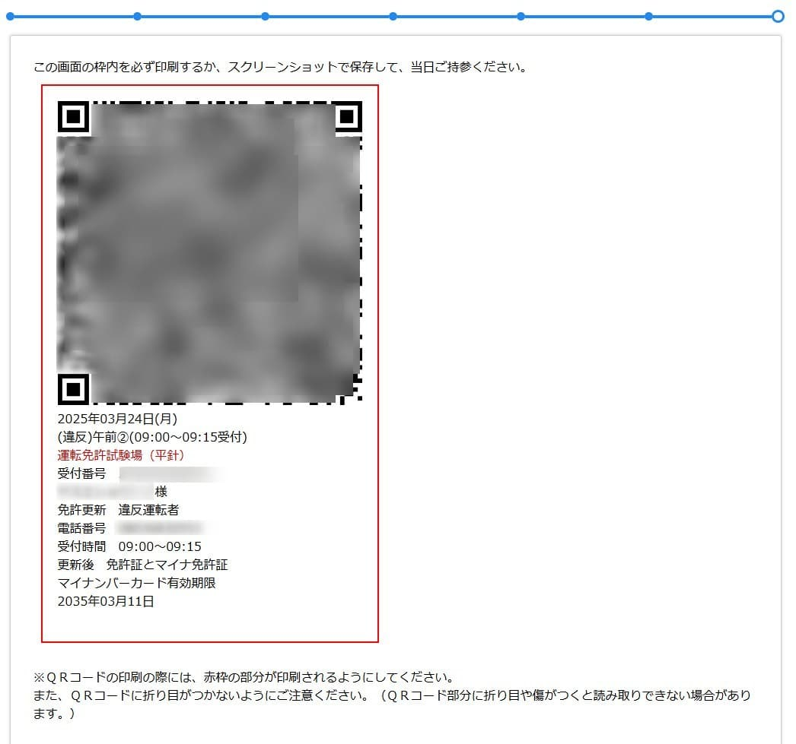

### 免許証更新の講習

当日、9時からの受付開始だったのでそれまでに移動します。  
最近新しい駐車場ができました。  
予約制なので比較的停めやすいのですが、500円かかります。まぁ仕方がない。  

試験場に入るとめちゃくちゃ人がいてびっくり。予約制でもこれだけいるのか・・・。  

先にマイナンバーカードに免許証用のアプリケーションをインストールする列に並びます。  
画面の指示通り指定の位置にマイナンバーカードを置いて少し待つだけ。さくっと終わりました。  

それから受付列へ。これが長蛇の列でなかなか進まず。  
講習時間になってしまうのではないかとやきもきしましたがどうにか無事に手続きを行う機械にまでたどり着きました。  

この機械で予約時に発行されたQRコードを読み込みます。  
あとは画面の指示通りボタンをポチポチしていけば必要な書類が印刷されます。  

更新費用は現金以外も利用可能になっていました。私はQUICPayを利用しましたが、QRコード決済もいける様子。  
愛知県警のサイトによれば以下のキャッシュレス決済が使えるそう。  

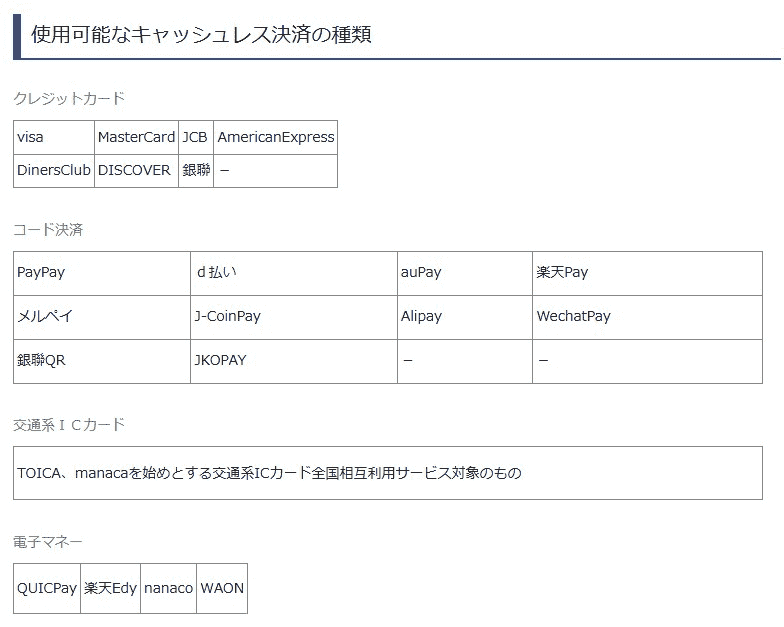  

[oembed:"https://www.pref.aichi.jp/police/shinsei/cashlesspayment.html"]

決済が完了するとレシートが発行されます。  
先ほど印刷された書類に必要事項を書いたら係の方にレシートと一緒に渡すと、レシートと書類にスタンプを押してもらえます。後は受付に書類を提出し、内容チェックが問題なければ受付完了。  

受付が終わったら視力検査と写真撮影を行い講習が行われる部屋に行きます。  
写真撮影はどんなふうに写っているかをチェックすることはできず、また一回しか撮影できないので注意。  

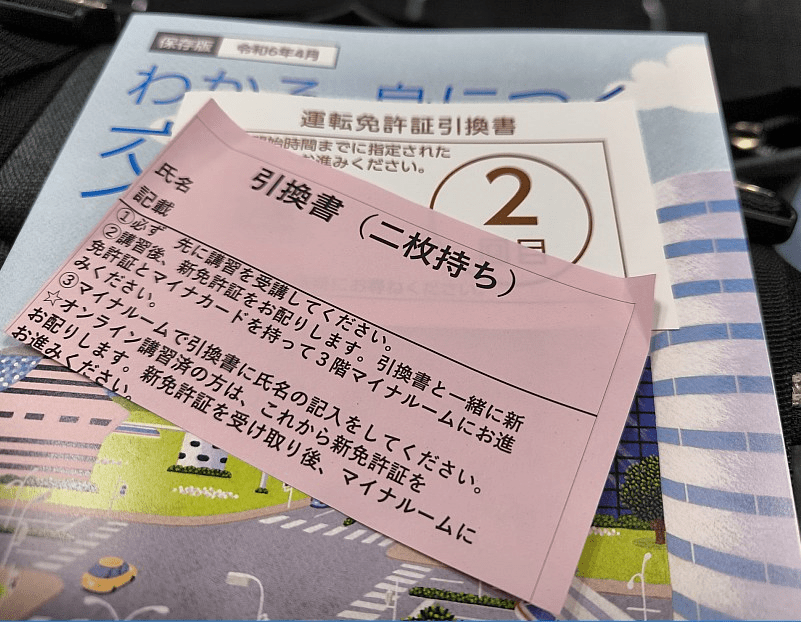  

今回私は違反者講習（Google マップ通りに走ったら思いっきり一方通行の道を走ってしまったバカ）なので、講習時間は2時間。途中15分の休憩が含まれます。  

### マイナ免許証の手続き

講習が完了したら新しい免許証を受け取れます。  
写真写りの酷さに絶望しつつ、次はマイナンバーカードに免許証情報を書きこむための手続きを行う部屋へ移動します。  

ぶっちゃけそこまでマイナ免許証の手続きをする人いないんじゃないかって思ってたのですが（マイナ保険証に対する不満の声とかマスコミが盛んに報じていたので、免許証も選ばない人多いんだろうなと）、思いのほか大量にいた様子。  
マイナルームという特設会場の前にずらーーーーーーっと人が並んでおり、免許証を受け取るのがほぼ最後だった私は最後尾に並ぶことに。  

11時50分に講習を終えてから、受け取った時間が15時。約3時間かかってしまいました。  

部屋の中には計7台の情報を書きこむ機器があったのですが、24日の初日なので担当の方も慣れておらず、またいろいろ説明もあるので一つ一つの対応に時間がかかってしまう様子。

部屋の外だけでも随分並んだのですが、部屋の中も長蛇の列があってさすがに心折れて列から抜ける人も。ただし、抜ける場合は事前にインストールしたAPを削除する対応を別途行う必要があるそうです。おそらく差額の返金も行われるんじゃないかと。  

あまりにも列が長いため周りの人と雑談が弾む弾む。初めて会った人と2時間近くしゃべりながら待ってましたが、これはこれで得難い経験だったかも。  

列の先頭まであと数人というタイミングで係の方から、先頭の方からここまでの方私についてきてくださいというのでついていったところ、別の部屋に通され、そちらでまた待つことに。  
その部屋には2台の機器がおかれていたのですが、7台あった部屋から2台の部屋に移動させられたのでかえって時間がかかる・・・。  
私の後に部屋に通された人はこれはおかしい！！！と係の人に滅茶苦茶怒ってました。気持ちはわかる。  

今回フローがあまりよくなかったので、単純に列に並ばせるのではなく番号札を用意するとか、今後待機オペレーションの改善に期待です。  

ようやく自分の番が回ってきたので手続きを進めます。  
途中オンライン講習を今後利用したいか確認されたので利用したい旨伝えたところ、パスワードを登録することを求められたので、タッチパネルで入力します。  
タッチパネルがA-Z並んでいるタイプなので打ちづらい・・・。QWERTYにも切り替えられるようにしてくれると助かる。  
入力が終わると、マイナンバーカードに登録された情報が正しいかどうかを確認するよう求められます。  
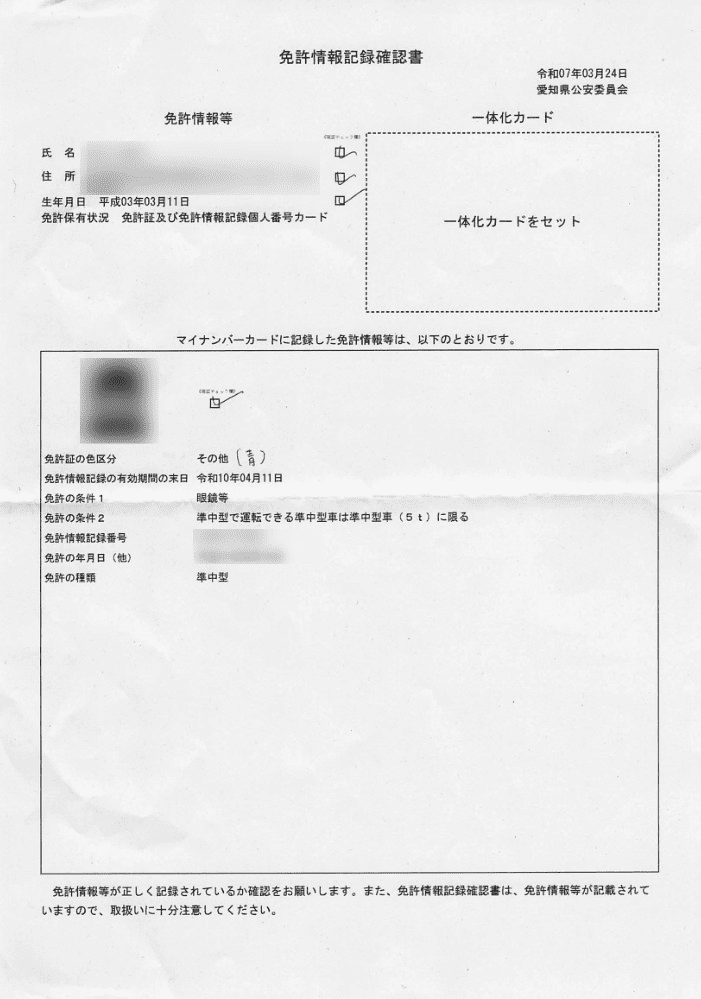
免許証の色区分が `その他` になっているので確認したところ、 `色区分` という表現ですが別にゴールド、青みたいな形で持っているのではなく、`新規` 、 `優良` 、`その他` の3パターンで持っているため、今回青なので `その他` になっていると回答をもらいました。  
だったら `色区分` という表現は誤解を招くのでやめたほうが良いと思う・・・。  

とりあえずこれで手続きは完了。  
並んでいる時間がめちゃくちゃあっただけで、実際の手続きそのものは策っと終わりました。  
今後は係の方も慣れるでしょうし、今後はオペレーションも改善されるでしょうからこんなにかかることは無くなることでしょう。  

初日ということで報道カメラも回っており、何人か取材に答えてました。  
なんとなくインタビュアーの質問内容がネガティブ寄りだったように感じるのは気のせい・・・？  

私は取材されなかったんですが、帰宅してニュースを見てたら思いっきり列に並んで前の人と雑談にいそしんでいる自分が出てきて白目。映ってるならもう少しお腹ひっこめるとかして映りを良くしておきたかった・・・ｗ

### マイナ免許証読み取りアプリ

とりあえずこれでマイナ免許証の手続きは完了しました。  
では実際にマイナ免許証のデータが登録されているかを確認したいと思います。  

警察庁が `マイナ免許証読み取りアプリ` というアプリを公開しています。  
スマートフォン（Android/iOS）だけでなくパソコン向けにもMicrosoft Storeで公開してるようです。  

今回は試しにAndroidで検証してみました。  

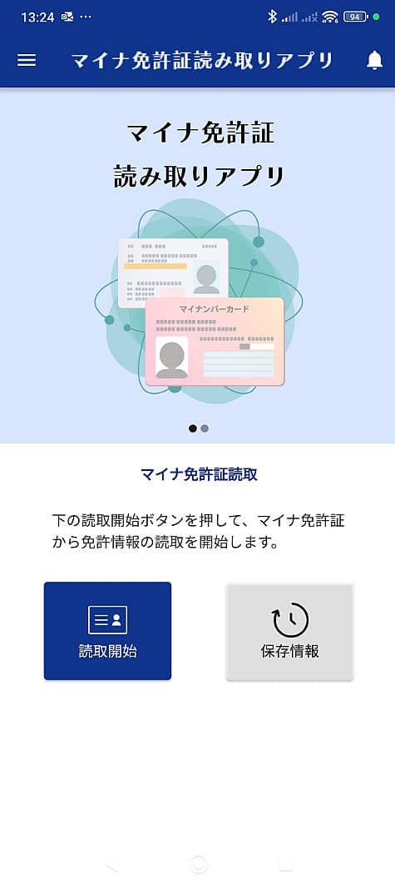  

このアプリをインストールし、プッシュ通知を受け取るように設定しておくと、今後免許証の有効期限が近づいたときに教えてくれるようです。これで酢酸先生のように更新はがきが届かなくて免許を失効するなんてことが減るといいんですが。  
（ハガキが届かないことよりプッシュ通知が届かないケースの方が多そう）  
[oembed:"https://blog.ch3cooh.jp/entry/2019/07/04/210000"]
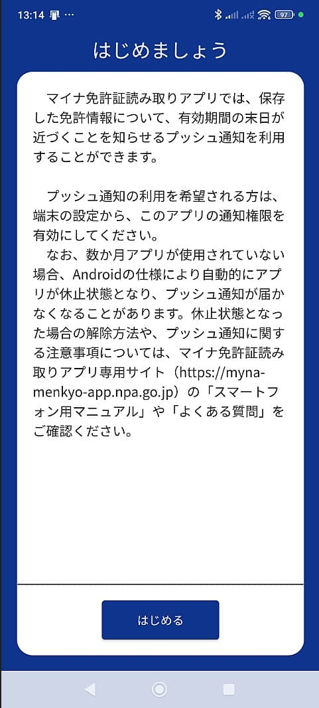  

暗証番号を入力し、マイナンバーカードを読み込むとこんな感じで情報が表示されます。  

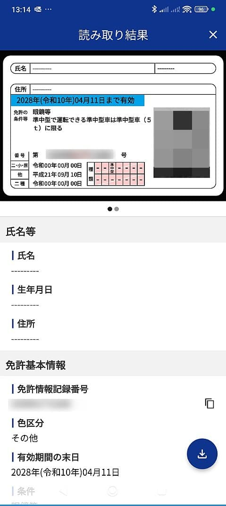  
 
氏名と住所を表示させる場合は4桁の暗証番号だけでなく、券面に記載されている生年月日と有効期限、セキュリティコードの入力が必要になる様子。ちょっと面倒。  

なお、いちいちマイナンバーカードを読み込ませなくても済むように保存する機能もあります。  

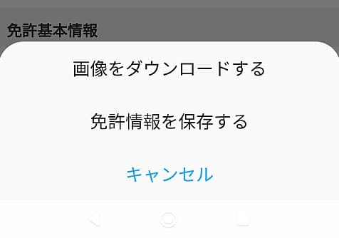

ただし、免許情報を保存したところでこれは免許証そのものではないため、現行の免許証かマイナンバーカードのいずれかを携帯しないといけないことには変わりません。  
早くスマホ搭載が来てほしいですが、そのためには皆がマイナ免許証の利用開始をして国会に圧力をかけないといけないかも。    

ちなみにPC版の読み取りアプリでは、印刷もできるようです。  
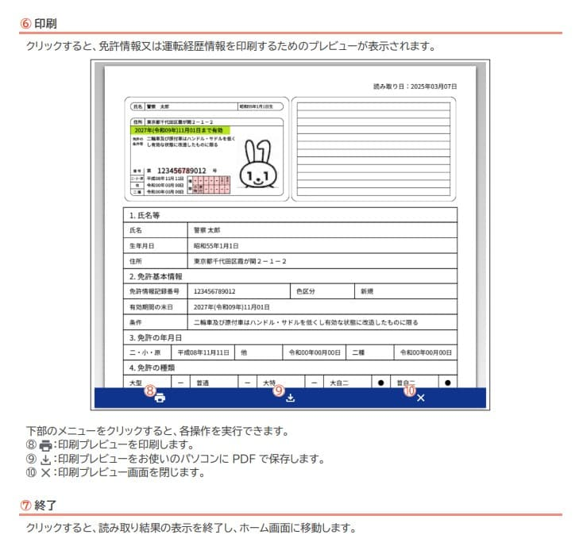

### マイナポータル  
先ほどは警察庁のアプリで情報を取得しましたが、マイナポータルアプリでも免許証の情報を閲覧することはできます。  

ただし、先ほどのアプリは直接マイナンバーカードの免許証APから情報を取得するのに対し、マイナポータルアプリでは一度属性連携と電子署名を行う必要がありました。  

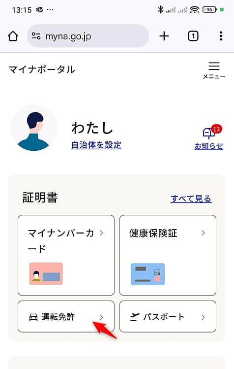   
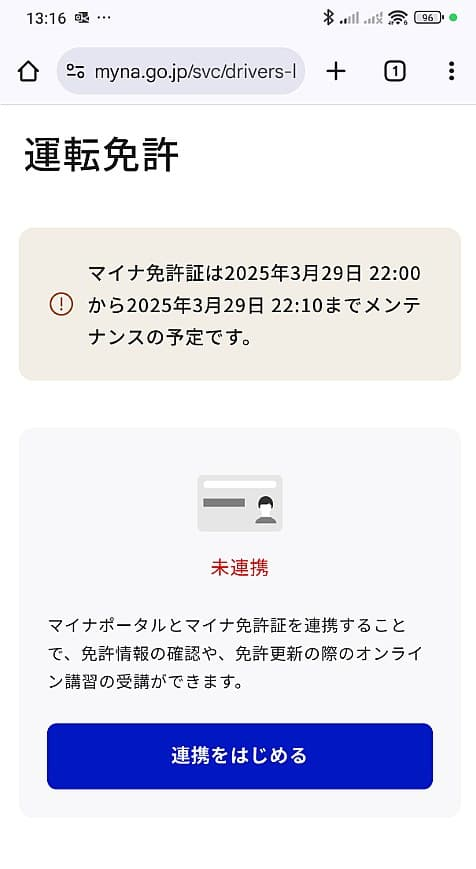   
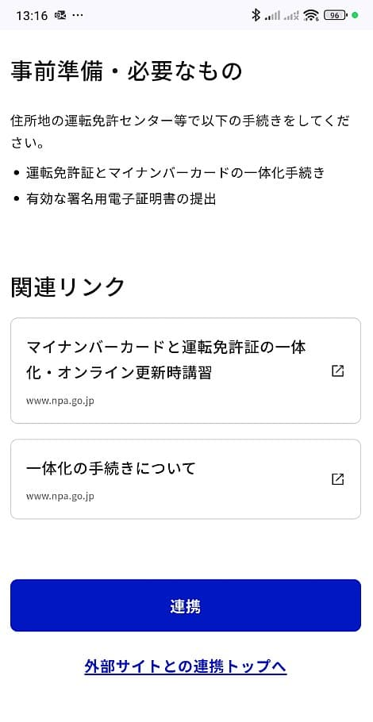   
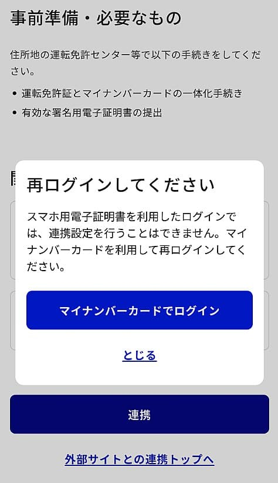   
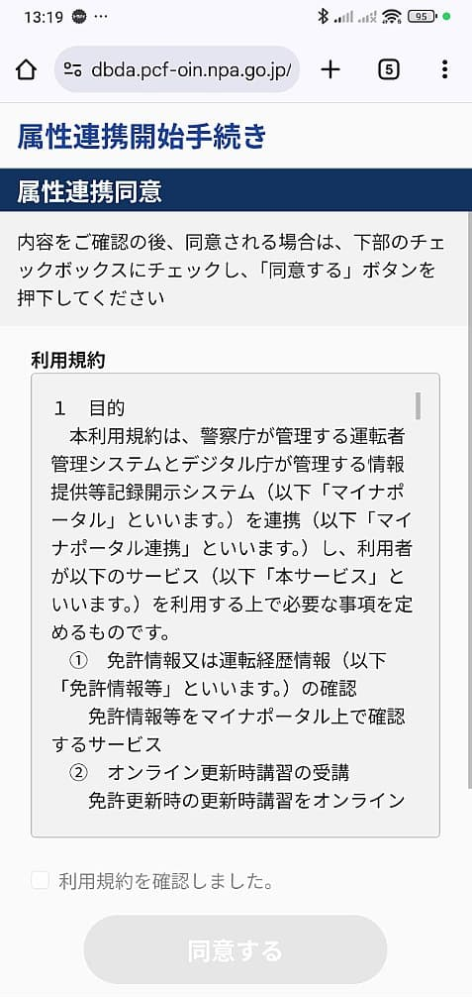   
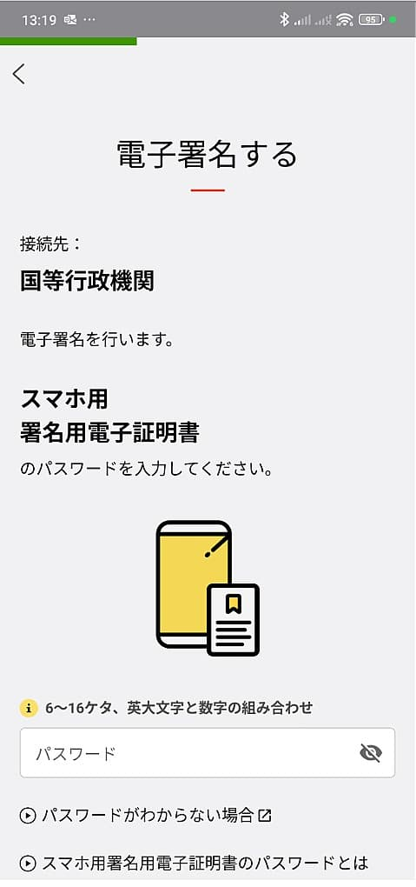   
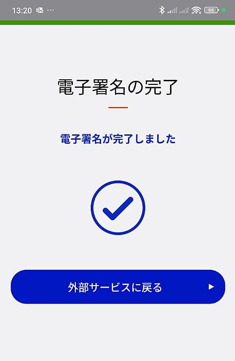   
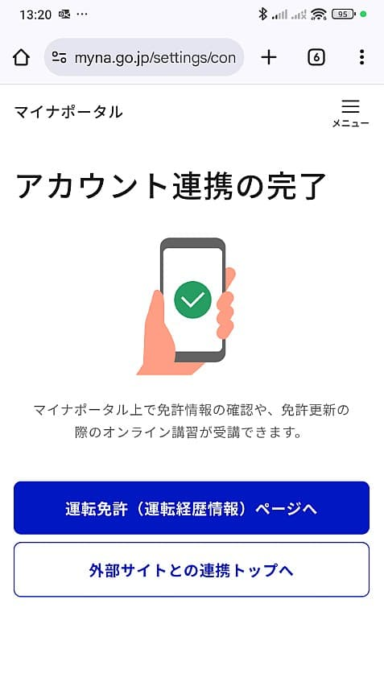 

また、連携を行う場合はスマホに載ってる電子証明書によるログインではなくマイナンバーカード本体を利用したログインをしないといけないようです。  
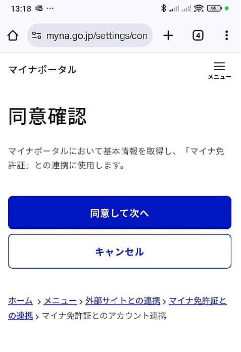

ここまでやればようやくマイナポータルで免許証情報が閲覧できるようになります。  

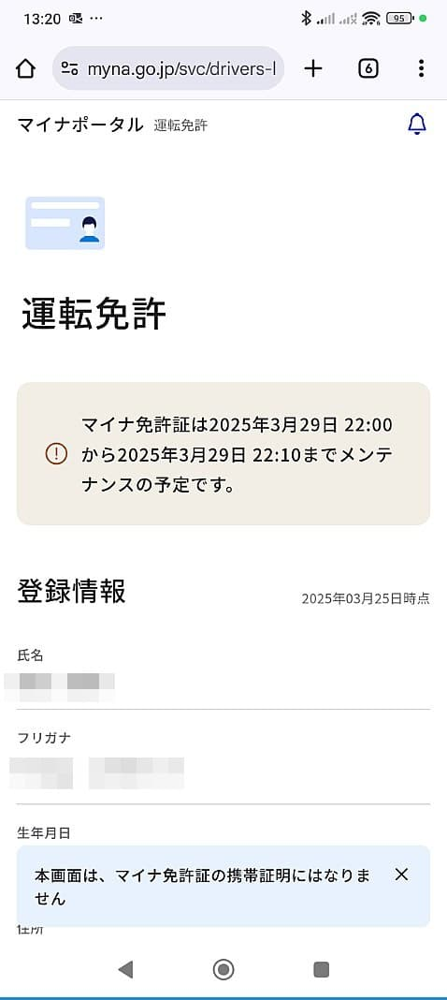   
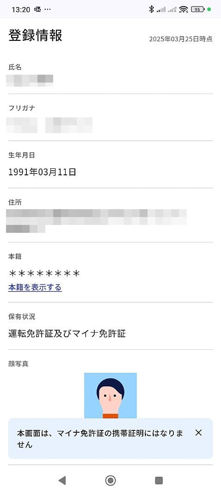  
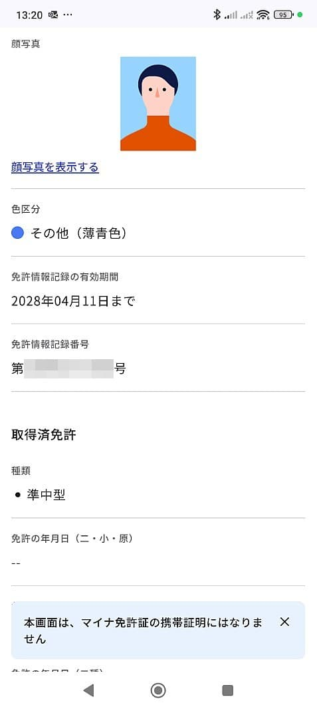   

読み取りアプリのように免許証のようなデザインの画像は表示されず、情報が一覧表示されているだけです。  
マイナポータルでは色区分のところが `その他（薄青色）`とわかりやすく表示されますね。このあたりは読み取りアプリ側も対応しておいてほしいところ。  

今はまだ受講できないですが、ここからオンライン講習の受講が行えるようになる模様。  
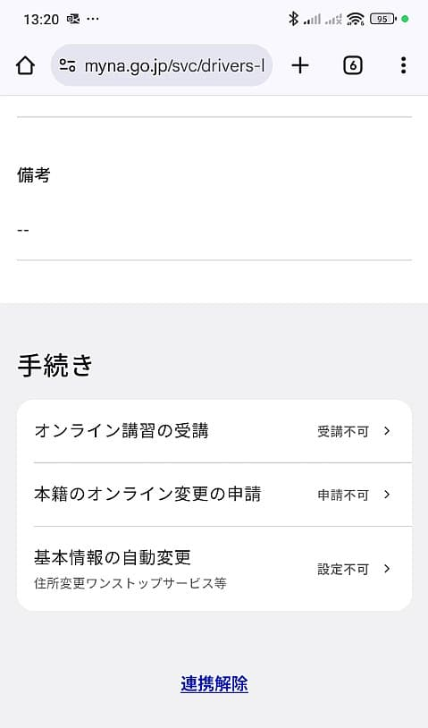

初日は読み取りアプリにバグが見つかったり愛知県下でも警察署でのマイナ免許証手続きのシステムがトラブルを起こすなどありましたが、こういうデジタル化は今後の日本にとって必要不可欠なものになりますし、問題が初日にわかってよかったといったところ。  

早期にスマホ搭載まで行われることを願っています。  
