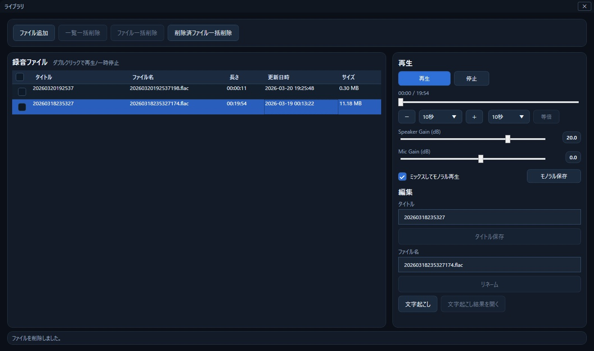

普段仕事をする際、Slackのハドルミーティングを利用してディスカッションを行ったりしています。  
話している最中にメモを取れないこともあるので、スピーカーの出力とマイクの入力を録音し、後から必要に応じて録音を聞き直すようにしてました。  

これまでは有料の録音ソフトを利用しており、それなりに便利に使っていたんですが、いくつかどうしても使いづらいと思うところがあり、自作することに。  
CodexやClaude Codeにいろいろ頑張ってもらいながら作ったソフトが実用レベルに至ったので、公開することにしました。  

<!-- more -->

## VoxArchiveの紹介

今回作った `VoxArchive` は以下のような機能を持っています。  

- スピーカー、イヤフォンなどの出力デバイスとマイク入力を別チャンネルで同時録音
  - 通常の出力デバイス録音だけでなく、プロセス単位のループバック録音にも対応
- グローバルホットキーによる即時録音
- 録音したファイルの一覧表示
  - シークバーでの再生位置調整、再生速度調整に対応
- チャンネル単位でのゲイン値調整
- Whisperによる文字起こし 

## イメージ
##### メイン画面

##### 録音中

##### 録音ライブラリ

## 特徴
### 出力デバイスと入力デバイスの別チャンネル同時録音
VoxArchiveはスピーカーやイヤフォンなどの出力デバイスとマイク入力をミックスすることなく別チャンネルで同時録音し、FLAC形式で保存しています。  
先述のソフトでどうしても気に入らなかったのが録音時に出力音と入力音をミックスして録音してしまうこと。  
録音する前に音量バランスを調整しておかないと録音後に片方の音が小さくて聞き取れなかった・・・なんてことがありました。  
VoxArchiveはチャンネルを分離して保存することでこの問題を解消しています。  

### プロセスループバック録音対応
出力デバイス録音の場合、PCで流れるすべての音を拾うことになるため、例えばメールの受信音などまで拾ってしまうことがあります。  
文字起こしをするときなどに邪魔になるそういった雑音をシャットアウトするため、プロセスループバック録音に対応しました。  
これを利用すれば例えばSlackから出力される音声のみを録音することが可能です。  

### 再生時のチャンネル単位のゲイン値調整  
入力音と出力音を別チャンネルで録音しているため、そのまま再生すると左右でそれぞれの音が出力されてしまいます。  
VoxArchiveのライブラリ画面では、再生時にチャンネルをミックスしてモノラル再生できるほか、各チャンネルでゲインの値を調整できるようにしています。  
これによって録音時に音量バランスを気にせず、再生時に聞き取りやすいバランスに音量を調整することが可能になっています。  
また、ほかのソフトでも再生しやすいよう調整後のゲインで再エンコードしてファイルを書きだすことも可能です。

### Whisperによる文字起こし
Whisperを利用し、ローカル環境で文字起こしが行えるようにしています。  
CUDAにも対応しているので、対応GPU環境であれば30分の録音でも5分程度で文字起こしが完了します。  

## 公開ページ  

GitHubのReleaseページからダウンロードできます。  
内部で `ffmpeg` を利用しているため、別途インストールをしてください。  
今はSmartScreenがブロックする関係でWinGetのパッケージ登録ができてないんですが、そちらが通ったら `ffmpeg` も自動的にインストールできるようになるはず。  

[oembed:https://github.com/Ovis/VoxArchive/releases]

また、せっかくなので専用の紹介ページを用意しました。  

[oembed:https://software.esheep.dev/voxarchive/]
