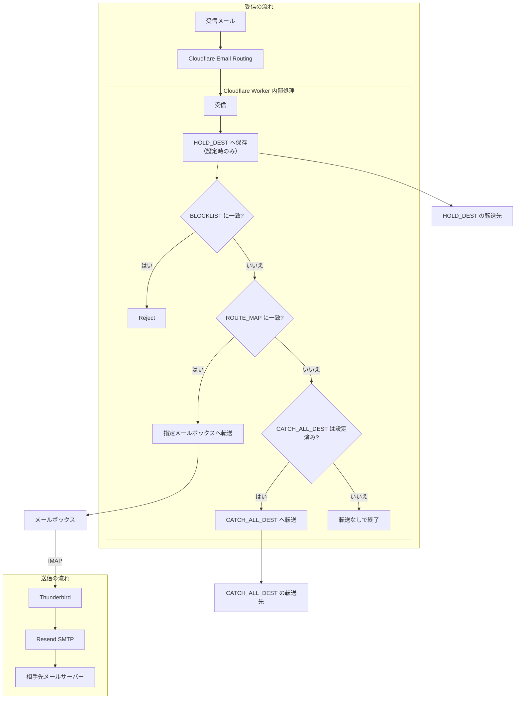
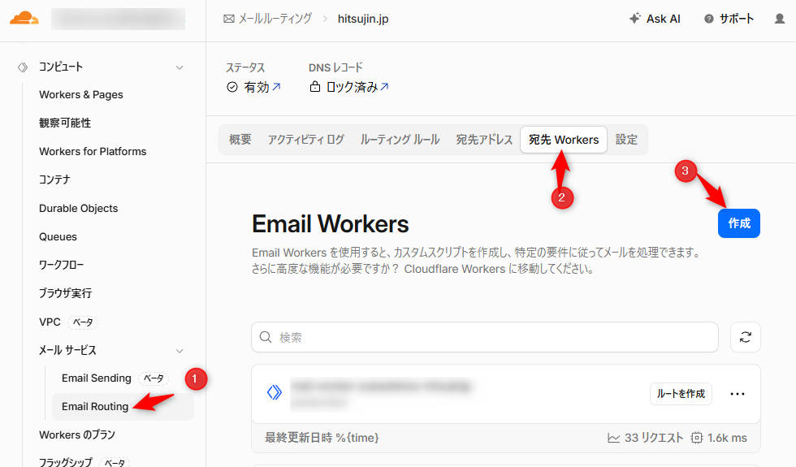
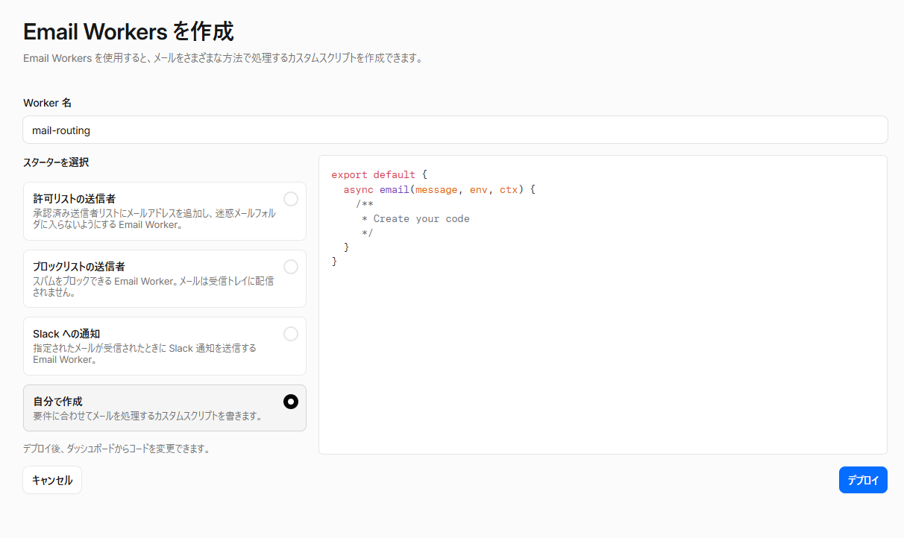
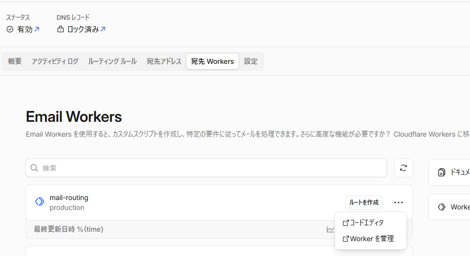
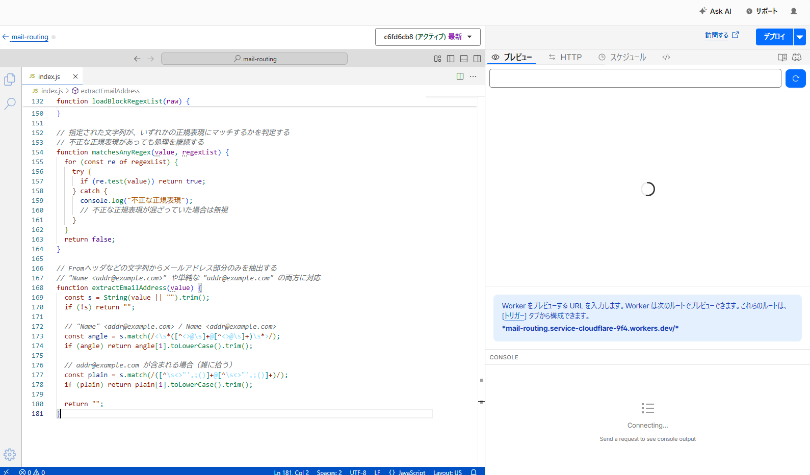
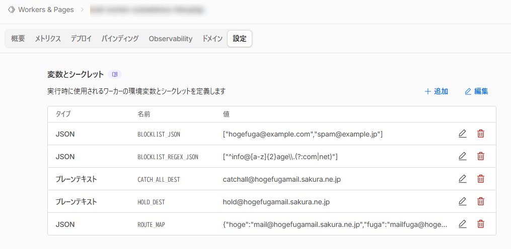
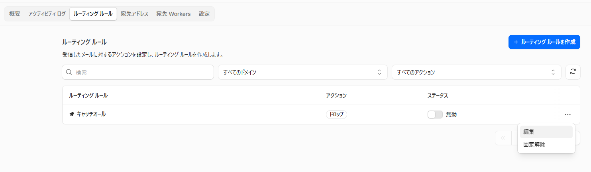
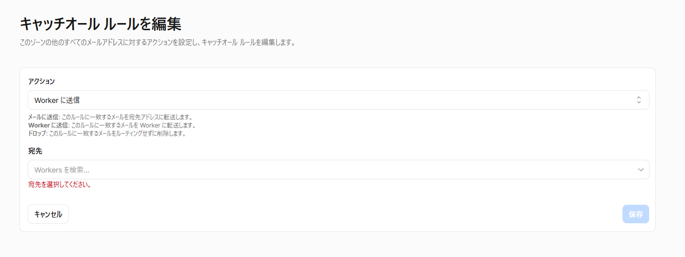
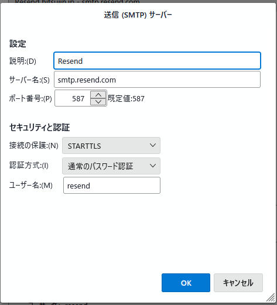
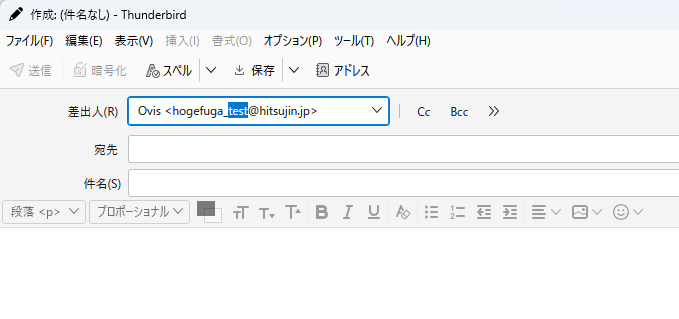

長らくOffice 365 Business Standardを契約し、そちらのExchangeを利用して独自ドメインでのメール環境を用意していた。  

しかしながら昨今の各種値上がりや、そもそもでそこまでOffice 365を有効活用しきれていなかったことなどを鑑みて解約することを決意。  
それに伴ってメール送受信の環境を調整することにした。  

<!-- more -->

## これまでの環境
これまではOffice 365を1ライセンス契約し、独自ドメインでのメールアドレスを準備していた。  
1ライセンスだけだが、これでも複数のメールアドレスを用意することはできており、また以前紹介した以下の方法を利用し、エイリアスによる1サービス1メールアドレス体制としていた。  

[oembed:"https://blog.hitsujin.jp/entry/2018/04/11/082251.html"]

新しい環境でもエイリアスを使えるようにしないと、これまでに登録したすべてのサービスでメールアドレスを変更する必要が出てしまうので、エイリアスはマスト機能。  

また、上記の方法だと catchall とメール転送を駆使している関係で エイリアスのメールアドレスでメールを送信することができない。サポートとメールでやり取りしたりするときはどうしても元のメールアドレスを利用せざるを得なかったので、これは今回解決したいと考えていた。  

## 新しい構成

Google Workspaceなどを利用する手は考えたが、月々かかる金額はOffice 365とそれほど変わらないのでそれでは切り替える意味もない。  
ということで、極力安く対応する方法を検討した結果

- Cloudflare Email Routing
- Resend

を利用したメール送受信環境を構築することにした。この方法の場合、原則として無料で利用できる。  

Cloudflare Email Routing は名前の通りCloudflareが提供しているメール転送機能。  
CloudflareでDNS管理しているドメインであれば、原則として無料で利用できる。相当受信するとかしない限りは課金不要なのがうれしい。  
これを利用すれば、独自ドメインでメールを受けつつ、GmailなりOutlook.comなりのメールボックスに転送できる。  

Resendはメール送信サービス。  
著名なところではSendGridがあるが、こちらは昔は個人でも登録して一定件数まで無料で利用できたが、最近はどうも使えない様子。  
Resendは無料枠として1日100通、一か月あたり最大3000通メールを送信可能。APIやSDKも非常によくできていて、個人的に今後メール送信サービスを仕事で使うならこちらを使ってみたいなと思っている。  

なお、上記の通りメール転送サービスと送信サービスを組み合わせるわけなので、メールボックス自体は別途用意する必要がある。  

GmailやOutlook.comなどのサービスで十分だとは思うが、昨今メールの内容を見てアカウント毎BANされたというような事例を聞いており、手持ちのGoogleアカウントやMicrosoftアカウントがBANされたら相当困ったことになる。  
メインのアカウントとは別のアカウントを作ることも考えたが、連鎖的にBANされたら元も子もないということで、今回は別途メールボックスを借りることにした。  
というわけで今回はさくらのメールボックスを借りている。月々88円で済むのでお財布にも優しい。  
（さくらのメールボックスを使うならそれで独自ドメイン設定して使えばいいじゃないかという話ではあるが、さくらのメールボックスだとエイリアスごとに設定を追加する必要があって面倒くさい）

今回の構成をざっくりと図に表すとこんな感じ。  



## 前提条件
- 利用したいドメインをCloudflareでDNS管理していること  
- Cloudflare Email RoutingのDNS設定をしていること
- 受信用メールボックスを用意していること
- Resendの登録、ドメイン認証を済ませていること

## Cloudflare Email Routing側の設定

事前にEmail Routingを利用するためのDNS設定はできている前提。  

対象のドメインを開き、メールサービス→Email Routingへ。  
`宛先Workers` の画面を開き、 `作成` ボタンを押下。  


Worker名はあとから一目でわかるものに変更。  
スターターを選択はどうせ書き換えるのでどれでもいいが、 `自分で作成` を選択して `デプロイ` ボタン押下でOK。  


先ほどの画面に戻ると今作ったWorkerが表示されているので、三点リーダを押下して `コードエディタ` へ。  


エディタ画面が開いたら、エディタに記載されている既存のコードを破棄して以下のコードをエディタに張り付け、デプロイボタンを押下。  

```javascript
export default {
  async email(message, env, ctx) {

    // === 退避用転送（証跡保存） ===
    // すべてのメール（迷惑メール含む）をまず HOLD_DEST に転送する。
    // これは後からの調査・復旧用の証跡確保が目的。
    try {
      if (env.HOLD_DEST) {
        await message.forward(env.HOLD_DEST);
      }
    }
    catch (error) {
      console.log("退避用アドレスへの転送に失敗:", error?.message || error);
      // ここでは return せず、後続処理を継続する
    }

    // === 宛先の正規化 ===
    const rcpt = (message.to || "").toLowerCase().trim();
    const [local] = rcpt.split("@", 2);

    // === 送信元の正規化（Envelope From） ===
    const mailFrom = (message.from || "").toLowerCase().trim();

    // === ブロックリスト準備 ===
    // 環境変数から静的リストおよび正規表現リストを読み込む
    const blocked = loadBlockList(env.BLOCKLIST_JSON);
    const blockedRegexes = loadBlockRegexList(env.BLOCKLIST_REGEX_JSON);

    // === ヘッダFromの抽出 ===
    // 表示用Fromヘッダからメールアドレス部分のみを抽出する
    const headerFrom = extractEmailAddress(message.headers?.get?.("From") || "");
    const replyTo = extractEmailAddress(message.headers?.get?.("Reply-To") || "");

    // === ブロックリスト判定 ===
    // Envelope From, Header From, Reply-To のいずれかがブロック対象に該当する場合は拒否する
    // HOLD_DEST にはすでに保存済みなので、ここでは配送のみ拒否する
    if (
      blocked.has(mailFrom) ||
      matchesAnyRegex(mailFrom, blockedRegexes) ||
      (headerFrom && (blocked.has(headerFrom) || matchesAnyRegex(headerFrom, blockedRegexes))) ||
      (replyTo && (blocked.has(replyTo) || matchesAnyRegex(replyTo, blockedRegexes)))
    ) {
      // 恒久エラーとして拒否（迷惑メール扱い）
      console.log("迷惑メールと判断:", message.from);
      message.setReject("Message rejected: sender is blocklisted");
      return;
    }
    // ===============================================

    // === ルーティングテーブルの読み込み ===
    // 環境変数から JSON を読み込み、キー→転送先のマッピングとして扱う
    let routes = env.ROUTE_MAP || {};
    if (typeof routes === "string") {
      try {
        routes = JSON.parse(routes);
      } catch {
        routes = {};
      }
    }

    // === ローカル部の区切り文字定義 ===
    // アドレスの prefix 抽出時に使用（例: user+tag, user_test）
    const separators = ["_", "+"];

    // === prefix 抽出 ===
    // 区切り文字がある場合はそれ以前をキーとして使用する
    let key = local;
    const firstSepIndex = findFirstSeparatorIndex(local, separators);
    if (firstSepIndex !== -1) {
      key = local.slice(0, firstSepIndex);
    }

    // === 宛先ルーティング ===
    // prefix に対応する転送先があればそこに転送する
    const dest = routes[key] || null;
    if (dest) {
      try {
        await message.forward(dest);
        return;
      } catch (error) {
        console.log("転送に失敗:", error?.message || error);
        return;
      }
    }

    // === catch-all ルーティング ===
    // どのルールにも一致しなかった場合のフォールバック転送先
    if (env.CATCH_ALL_DEST) {
        console.log("どの条件にも一致しないためcatchallに投げる");
        try {
            await message.forward(env.CATCH_ALL_DEST);
        } catch (error) {
        console.log("転送に失敗:", error?.message || error);
        }  
    }

  },
};

// 指定された文字列内で、複数の区切り文字のうち最も早く出現する位置を返す
// prefix 抽出のために使用する
function findFirstSeparatorIndex(str, seps) {
  let min = -1;
  for (const s of seps) {
    const i = str.indexOf(s);
    if (i !== -1 && (min === -1 || i < min)) min = i;
  }
  return min;
}

// 環境変数からブロックリスト（完全一致）を読み込み、Set として返す
// JSON配列を想定し、不正な形式の場合は空リストとして扱う
function loadBlockList(raw) {
  const set = new Set();
  if (!raw) return set;

  try {
    const arr = typeof raw === "string" ? JSON.parse(raw) : raw;
    if (!Array.isArray(arr)) return set;

    for (const v of arr) {
      if (typeof v === "string" && v.trim()) {
        set.add(v.toLowerCase().trim());
      }
    }
  } catch {
    console.log("ブロックリストのJSONが破損している");
    // JSON が壊れていたら無効（全通し）
  }
  return set;
}

// 環境変数から正規表現によるブロックリストを読み込み、RegExp配列として返す
// 各要素は文字列として定義されていることを前提とする
function loadBlockRegexList(raw) {
  const list = [];
  if (!raw) return list;

  try {
    const arr = typeof raw === "string" ? JSON.parse(raw) : raw;
    if (!Array.isArray(arr)) return list;

    for (const v of arr) {
      if (typeof v === "string" && v.trim()) {
        list.push(new RegExp(v));
      }
    }
  } catch {
    console.log("正規表現ブロックリストのJSONが破損している");
    // JSON が壊れていたら無効（全通し）
  }
  return list;
}

// 指定された文字列が、いずれかの正規表現にマッチするかを判定する
// 不正な正規表現があっても処理を継続する
function matchesAnyRegex(value, regexList) {
  for (const re of regexList) {
    try {
      if (re.test(value)) return true;
    } catch {
      console.log("不正な正規表現");
      // 不正な正規表現が混ざっていた場合は無視
    }
  }
  return false;
}

// Fromヘッダなどの文字列からメールアドレス部分のみを抽出する
// "Name <addr@example.com>" や単純な "addr@example.com" の両方に対応
function extractEmailAddress(value) {
  const s = String(value || "").trim();
  if (!s) return "";

  // "Name" <addr@example.com> / Name <addr@example.com>
  const angle = s.match(/<\s*([^<>@\s]+@[^<>@\s]+)\s*>/);
  if (angle) return angle[1].toLowerCase().trim();

  // addr@example.com が含まれる場合（雑に拾う）
  const plain = s.match(/([^\s<>"',;()]+@[^\s<>"',;()]+)/);
  if (plain) return plain[1].toLowerCase().trim();

  return "";
}
```



`バージョンを保存しました` と表示されたら 左上のリンクからWorkerの概要ページへ。  
設定画面に遷移し、以下の必要な設定項目を追加する。  

| 名前 | タイプ | 値 |
| --- | --- | --- |
| BLOCKLIST_JSON | JSON | ["hogefuga@example.com","spam@example.jp"] |
| BLOCKLIST_REGEX_JSON | JSON | ["^info@[a-z]{2}hoge\\.(?:com|net)$"] |
| CATCH_ALL_DEST | プレーンテキスト | キャッチオール用アドレス（設定は任意） |
| HOLD_DEST | プレーンテキスト | 保持用転送アドレス（設定は任意） |
| ROUTE_MAP | JSON | {"prefix":"転送先アドレス"} |

`ROUTE_MAP` のJSONでは対象のプレフィックスと転送先アドレスを指定する。  
例えば `service_〇〇@example.com` に対してのメールを `service@example.com` に転送したい場合は
```json
{"service":"service@example.com"}
```
と言った感じ。 `separators` の定数でセパレーターとなる記号を定義しているので、 `_` `+` 以外の記号に対応したい場合は定数の定義を調整すればOK。  
複数の転送設定をする場合は

```json
{"hoge":"hoge@example.com", "fuga":"fuga@example.com"}
```
という形でカンマ区切りで設定。  

迷惑メールが来た場合、 `BLOCKLIST_JSON` または `BLOCKLIST_REGEX_JSON` にてブロックが可能。  
悪名高い株式会社WORKTANKのようにドメインを少しだけ変えて何度でも送ってくるような悪質なものは正規表現でブロック。  

キャッチオールで指定外のアドレスに対してきたものも拾いたい場合は `CATCH_ALL_DEST` に転送アドレスを登録。  
また、ブロックするメールも含めて転送しておきたい場合（メール証跡とかの意図）は `HOLD_DEST` に転送先アドレスを指定しておけばOK。  



なお、転送先のアドレスは事前にCloudflareから転送を許可する設定が必要。 `宛先アドレス` からアドレスを追加し、届いたメールのURLを開いて認証を進めておくこと。  

あとはルーティングルールの設定をする。  
キャッチオール設定を利用するのでキャッチオール設定の編集画面を開き、アクションを `Workerに送信` に変更し、宛先は先ほど作ったWorkerを選択して保存。  
あとはステータスを有効にすればOK。  




特定のエイリアス付きメールアドレスが情報漏洩して迷惑メールが来るようになった場合、ルーティングルールで直接ドロップすると楽。  
ただしその場合はWorkers側に処理が回らないので、`HOLD_DEST` による転送はされない点に留意。  

## Resend側の設定
こちらは特に設定というほどのものはない。  
Resendでアカウント登録をして対象のドメインを認証しておくだけ。  

## メール送信
エイリアスでのメール送信はResendのAPIを利用して直接そのエイリアス付きのメールアドレスをFromとして指定して送る方法か、ResendのSMTP機能を利用することになる。  

前者は一方的にそのアドレスで送るだけなら十分だが、メールに返信する形で送るときはメールクライアントから操作できるほうが望ましいので後者の設定を行う。  

これまではExchangeを利用していたこともあってOutlookを利用していたが、残念ながらOutlookでは送信元アドレスを自由に変更することは仕様上できないとのことだったので、この機会に久しぶりにThunderbirdを利用するようにした。  
受信側はIMAPで設定し、送信サーバーの設定だけResendに向けておく。  
パスワードはAPIキーを利用する。  

[oembed:"https://resend.com/docs/send-with-smtp"]




こちらはメール作成のウィンドウで差出人から `差出人アドレスをカスタマイズ` を選択するとアドレス変更が可能。  



## 終わりに

今回Cloudflare Workersも利用しているが、一日当たり10万リクエストまで無料で使えるので、よほどのことがない限りは無料枠で収まるはず。  
10msのCPU time制限も特にこれまで引っかかることはなく、直近確認した限りでは平均1.4msと安定的に動作している。  
スクリプトなので今後必要に応じて書き換えて概要をDiscordにWebHookで通知するとかいったこともできる（そもそもWorker作成時にSlack通知のテンプレートがある）し、不満があったらまた自分好みにしやすいのは便利。  

`+` のエイリアスはGmailが採用している関係で最近はスパム送信側も学習して `+` 以降を除去する形で送ってくるようになったみたいだけど、今回の構成ならRFCに反しない範囲かつWebサービス側で利用できる記号の範囲なら好きな記号を使えるのも便利。  
各ウェブサービス単位にエイリアス付きメールアドレスにしたことで、情報漏洩があってもそのエイリアスごとブロックするだけで済むのでメールボックスが汚れづらくなるのが大きい。  
過去あった事例だと  
- Lifebear
- ジャパンレンタカー
- スマートパーキング

の情報漏洩でスパムメールが来るようになったときもこの方法で対応したし、最近だとかっぱ寿司が（まだ情報漏洩のニュースにはなってないが）お漏らししたけど、ブロックしたことでメールボックスの平穏は保たれている。  
