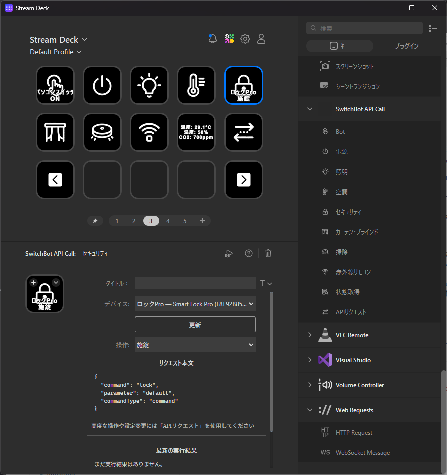

ChatGPTと要件の深堀をして、決まった内容をそのまま実装してもらう形でちまちまと個人的に欲しいものを作るのにはまっているひつじです。  
構想はあったし自分で実装できるけど、時間がなくて後回しにしていたものなんかをAIに任せて楽をしてます。  

そんなわけで今回、SwitchBotのAPIを叩いて、SwitchBot製品や赤外線リモコンの登録をしている家電の操作をSTREAM DECKで行うためのプラグインを作ってみました。  

[oembed:"https://github.com/Ovis/SwitchBot.StreamDeckPlugin"]

SwitchBotはAPIを公開しており、トークンさえ発行すればだれでも自分が持っているSwitchBot製品の操作が可能です。  

[oembed:"https://github.com/OpenWonderLabs/SwitchBotAPI"]

v1.0 のころはAPI実行時にあらかじめ発行していたトークンを渡すだけの単純なものだったので、[STREAM DECKのWebRequests プラグイン](https://marketplace.elgato.com/product/web-requests-d7d46868-f9c8-4fa5-b775-ab3b9a7c8add)で HTTP Requestを投げる形で割合簡単にAPI実行できてました。  

ただ、最新のv1.1ではHMAC-SHA256署名が必須となり、単純にHTTP Requestでだけで対応するのが難しくなっていました。  
一応v1.0もまだ提供されていますが、最新デバイスやLock Proでの開錠機能などといったセキュリティ上厳格な運用をしないといけない項目に対応していません。  


そんなわけで作ったのが `SwitchBot.StreamDeckPlugin` です。  



最初はプラグイン側で署名処理を肩代わりして簡単にAPIリクエストを行えるだけのものを作ったのですが、せっかくなので普段よく使う操作についてはAPIのURLやリクエスト本文を意識せず使えるようにアクションとして独立化させました。  

## 使い方

プラグインはGitHubのReleasesから `.streamDeckPlugin` をダウンロードしてインストールできます。  

[oembed:"https://github.com/Ovis/SwitchBot.StreamDeckPlugin/releases"]

利用するには、最初にSwitchBot OpenAPIのTokenとSecretを設定します。  
STREAM DECKにこのプラグインのアクションをどれか1つ配置し、設定画面の一番下にある「認証」を開いてTokenとSecretを入力、「接続テスト」で正常に接続できれば準備完了です。  

TokenとSecretはプラグイン全体で共有しているので、アクションを追加するたびに設定する必要はないようにしてます。 

現時点では、

- Bot
- 電源
- 照明
- 空調
- セキュリティ
- カーテン・ブラインド
- 掃除
- 赤外線リモコン
- 状態取得
- APIリクエスト

というアクションを用意しています。  

例えばBotを操作したい場合は「Bot」をキーへ配置すると、自分のSwitchBotアカウントに登録されている対応デバイスが一覧に出てくるので、操作したいBotと「押す」「ON」「OFF」などの操作を選択しておきます。  
あとはSTREAM DECKで該当のボタンを押せばAPIを叩いて処理されます。  

SwitchBot Hubに登録してある赤外線リモコンについても「赤外線リモコン」アクションから操作できます。  
SwitchBotのAPIだと赤外線リモコンで学習させたボタン情報を取得できないので、ここはリクエスト本文を手書きする必要があって面倒なんですが、致し方なし・・・。  

### デバイスの状態もキーに表示できる

操作するだけでなく、「状態取得」アクションを使ってSwitchBotデバイスの現在の状態を取得することもできます。  

取得した結果はSTREAM DECKのキー上にも表示できます。  
例えば温湿度計なら、

```text
温度: {temperature}°C
湿度: {humidity}%
```

のようなテンプレートを指定しておけば、APIから取得した値をキー上に表示できるようにしています。

一度そのデバイスの状態を取得すると、利用可能な項目が設定画面に表示されるようになってます。表示された項目をクリックするとテキストボックスに追加されます。  
テンプレートのテキストボックスを空欄にしておけば、取得した情報から主要な項目を自動的に選んで表示します。

状態はキーを押したときだけ取得することもできますし、1分、2分、5分、10分、30分、60分間隔で自動更新することもできます。

### APIを直接叩く機能

最初に作った「APIリクエスト」機能もそのまま残しています。
今回自分が持っていないデバイスも含めてある程度SwitchBotの製品が操作できるようなアクションを作ったわけですが、全部が全部対応できているわけではなく、リクエスト本文の構造的にも対応が難しいものがあったので、そういったものはこちらで対応できるようにしました。  

こちらでもHMAC-SHA256の署名生成などはプラグイン側で行うので、利用者は実行したいAPIのパスやリクエスト本文を設定するだけです。
よく使いそうなAPIについてはいくつかプリセットも用意しています。

## おわりに

というわけで、SwitchBotをSTREAM DECKから操作するためのプラグインを作ってみました。  

GitHubで公開しているので、同じようにSwitchBotとSTREAM DECKを使っている人がいれば試してみていただけると嬉しいです。  

[oembed:"[https://github.com/Ovis/SwitchBot.StreamDeckPlugin](https://github.com/Ovis/SwitchBot.StreamDeckPlugin)"]
