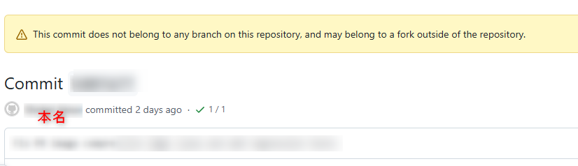
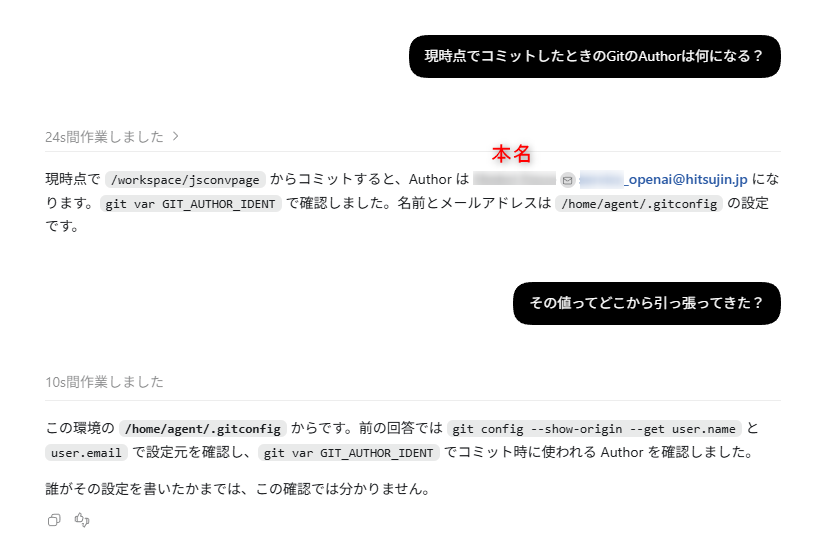
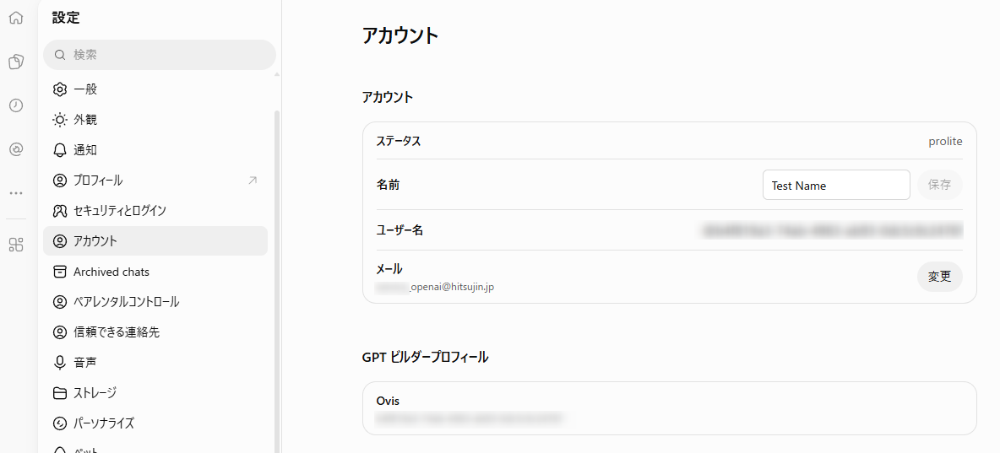
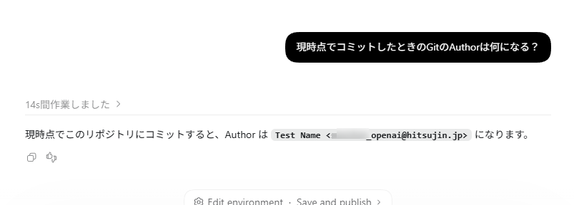

最近Codex Cloudが新しくなり、OpenAI側のクラウド環境でGitHub連携をして手軽に開発ができるようになりました。  

[oembed:"https://pc.watch.impress.co.jp/docs/news/2144612.html"]

ちょうど土日に実家に帰らないといけない用事があり自宅のPCの電源を入れていなかったのですが、もうすぐ期限が切れてしまうリセット権がもったいなかったので、この機会にCodex Cloudを利用して趣味で制作してるプログラムのコード改修を試してみることに。  

<!-- more -->

クラウド環境のセットアップをしてから具体的な要件を伝えて実装してもらい、コミット、プッシュをしてもらってそのままプルリクエストの作成まで完了。  
ここまでできたのでGitHubのプルリクエストの画面を開いてコードレビューをしようと思ってたんですが、パッと目に飛び込んできたのが私の本名。  
Author（作成者）が私の本名になってました・・・。    

慌ててForce Pushを行いAuthor情報を書き換えましたのですが、すでにプルリクエストまで作りきった状態だったため、プルリクエストのタイムライン上にForce Pushの履歴が残ってしまいました。  
これだとSHAの値から書き換え前の内容が辿れてしまいます。  
パブリックリポジトリだったのでプルリクエストは誰でも見える状態。困った。    

GitHubのサポートに連絡すれば対応してもらえるとは思うのですが、手続きが非常に煩雑でやってられないため、今回はリポジトリごと削除して作り直すことで対応しました。たまたま作り始めたばかりで特に消して困ることもなかったので。    

### どこから本名が？

どうやらCodex Cloudは、環境のセットアップをする際プロフィールではなくアカウント側の登録情報をもとにGit Authorを設定しているようです。 

ChatGPTのプロフィールではハンドルネームを設定していたのですが、OpenAIのアカウント側の設定には本名を登録していました。

メールアドレスについても、OpenAIとの契約用に使用しているエイリアス付きのアドレスが設定されていました。  

物は試しにアカウント設定で名前を `Test Name` にしてクラウド環境の新規作成をしたところ、Authorも `Test Name` で作成されました。  

ローカル環境であれば自分自身でAuthor設定を行うのでこんなこと起きないんですが、クラウド環境ではそのあたりの初期設定が自動で行われているということを失念しており、配慮漏れしてたのが敗因。

普段から本名開示している人なら困らないでしょうけども、私みたいに２ちゃんねるとか経由して匿名文化にどっぷり浸かり、本名をネットにさらすなんてとんでもない！って思っている人にはこのやらかしは痛い。  

ネット上で本名を公開したくない方は、Cloud環境のセットアップが完了したらまず最初にAuthor設定を正しく済ませてから指示を出すことを徹底。  
当たり前のことなのかもですが同じようにうっかりする人がいないとも限らないので、備忘録として。  
